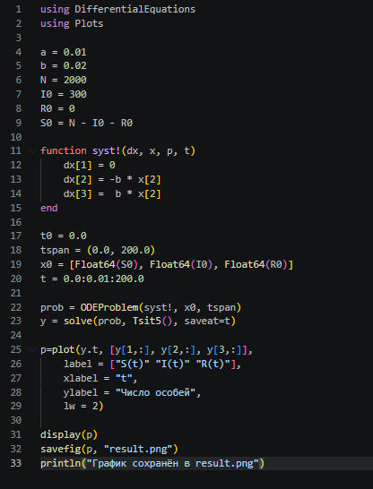
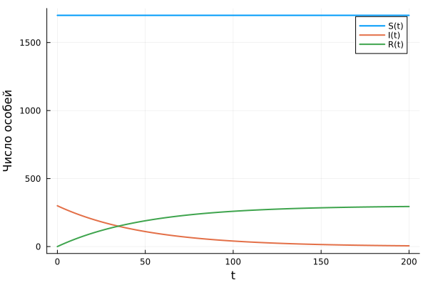
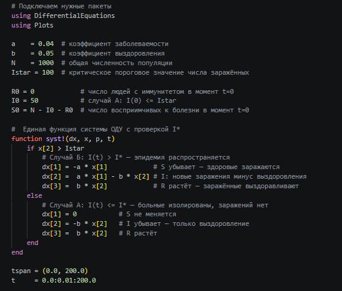
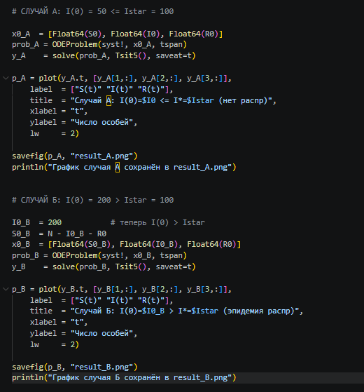
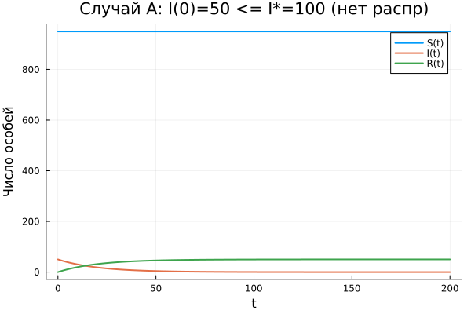
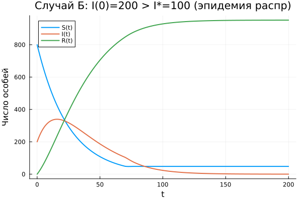
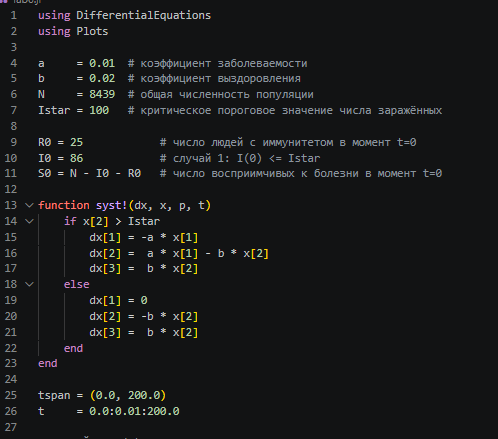
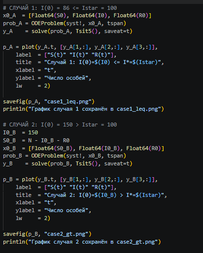
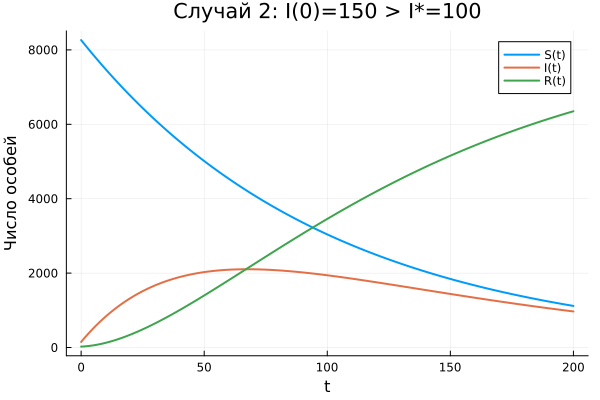

---
## Author
author:
  name: Тойчубекова Асель Нурлановна
  degrees: DSc
  orcid: 0000-0002-0877-7063
  email: kulyabov-ds@rudn.ru
  affiliation:
    - name: Российский университет дружбы народов
      country: Российская Федерация
      postal-code: 117198
      city: Москва
      address: ул. Миклухо-Маклая, д. 6
## Title
title: Лабораторная работа №6
subtitle: Математическое моделирование 
license: CC BY
date: today
date-format: "YYYY-MM-DD" # Example: 2025-09-06
---

# Информация

## Докладчик

:::::::::::::: {.columns align=center}
::: {.column width="70%"}

  * Тойчубекова Асель Нурлановна
  * Студент 3 курса
  * факультет физико-математических и естественных наук
  * Российский университет дружбы народов им. П. Лумумбы
  * [1032235033@rudn.ru](mailto:1032235033@rudn.ru)

:::
::: {.column width="30%"}

:::
::::::::::::::

# Цель работы

## Цель работы

Изучить простейшую математическую модель распространения эпидемии, реализовать численное решение системы дифференциальных уравнений и построить графики динамики изменения числа особей в каждой из трёх групп для трех различных начальных условий.

# Теоретическое введение.

## Теоретическое введение. 

Рассматривается изолированная популяция из *N* особей, разделённая на три группы:

- **S(t)** — восприимчивые к болезни, но здоровые особи
- **I(t)** — инфицированные (распространители инфекции)
- **R(t)** — здоровые особи с иммунитетом

Условие сохранения: $S(t) + I(t) + R(t) = N = \text{const}$

## Система дифференциальных уравнений

$$\frac{dS}{dt} = \begin{cases} -\alpha S, & \text{если } I(t) > I^* \\ 0, & \text{если } I(t) \leq I^* \end{cases}$$

$$\frac{dI}{dt} = \begin{cases} \alpha S - \beta I, & \text{если } I(t) > I^* \\ -\beta I, & \text{если } I(t) \leq I^* \end{cases}$$

$$\frac{dR}{dt} = \beta I$$

где **α** — коэффициент заболеваемости, **β** — коэффициент выздоровления, **I\*** — критическое пороговое значение.

# Выполнение лабораторной работы

## Пример из задания

На небольшом острове вспыхнула эпидемия свинки:

- *N* = 2000
- *I*(0) = 100
- *R*(0) = 0
- *S*(0) = *N* − *I*(0)
- Случай: $I(0) \leq I^*$

## Код для примера (Julia)

{width=45%}

## График примера

{width=60%}

## Собственный пример. Параметры

- *N* = 1000, I\* = 100, α = 0.04, β = 0.05
- *R*(0) = 0
- **Случай А:** *I*(0) = 50 ≤ I\* — эпидемия не распространяется
- **Случай Б:** *I*(0) = 200 > I\* — эпидемия распространяется

## Код собственного примера (Julia)

{width=45%}

## Код собственного примера (Julia)

{width=45%}

## График случая А: I(0) ≤ I\*

{ width=60%}

## График случая Б: I(0) > I\*

{ width=60%}

## Задание по варианту 54

Студенческий билет: 1032235033

- *N* = 8439
- *I*(0) = 86
- *R*(0) = 25
- *S*(0) = *N* − *I*(0) − *R*(0)
- α = 0.01, β = 0.02, I\* = 100
- Нужно рассмотреть случаи $I(t) \leq I^*$ и  $I(t) > I^*$

## Код по варианту (Julia)

{width=45%}

## Код по варианту (Julia)

{width=45%}

## График варианта. Случай 1: I(0) ≤ I\*

{ width=60%}

## График варианта. Случай 2: I(0) > I\*

{ width=60%}

## Выводы

- При $I(0) \leq I^*$ — эпидемия не развивается, болезнь затухает сама по себе
- При $I(0) > I^*$ — болезнь активно распространяется, достигает пика, затем идёт на убыль
- Критическое значение **I\*** является пороговым параметром, определяющим характер протекания эпидемии
- Полученные результаты согласуются с теоретическими предположениями модели
