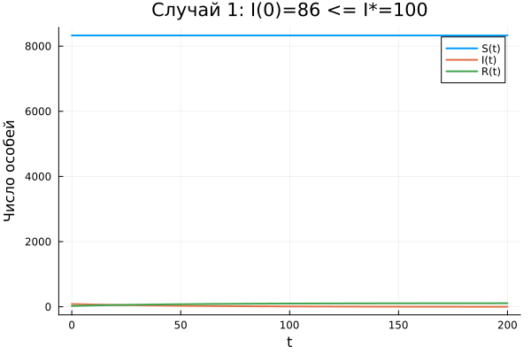

---
## Author
author:
  name: Тойчубекова Асель Нурлановна
  degrees: DSc
  orcid: 0000-0002-0877-7063
  email: kulyabov-ds@rudn.ru
  affiliation:
    - name: Российский университет дружбы народов
      country: Российская Федерация
      postal-code: 117198
      city: Москва
      address: ул. Миклухо-Маклая, д. 6

## Title
title: "Лабораторная работа №6"
subtitle: "Математическое моделирование"
license: "CC BY"
---

# Цель работы

Изучить простейшую мат модели распространения эпидемии, реализовать численное решение системы дифференциальных уравнений и построить графики динамики изменения числа особей в каждой из трёх групп для трех различных начальных условий.

# Задание

Выполнить задание по вариантам

# Теоретическое введение

Рассматривается изолированная популяция из N особей, разделённая на три группы:

- **S(t)** — восприимчивые к болезни, но здоровые особи
- **I(t)** — инфицированные (распространители инфекции)
- **R(t)** — здоровые особи с иммунитетом

Выполняется условие сохранения: S(t) + I(t) + R(t) = N = const.

Введём критическое значение I\*. При I(t) ≤ I\* больные считаются изолированными и не заражают здоровых. При I(t) > I\* инфицированные начинают заражать восприимчивых особей.

Система дифференциальных уравнений:

$$\frac{dS}{dt} = \begin{cases} -\alpha S, & \text{если } I(t) > I^* \\ 0, & \text{если } I(t) \leq I^* \end{cases}$$

$$\frac{dI}{dt} = \begin{cases} \alpha S - \beta I, & \text{если } I(t) > I^* \\ -\beta I, & \text{если } I(t) \leq I^* \end{cases}$$

$$\frac{dR}{dt} = \beta I$$

где **α** — коэффициент заболеваемости, **β** — коэффициент выздоровления.

# Выполнение лабораторной работы

Для начала реализуем численное решение системы дифференциального уравнения и построим график на примере, которыый дан в лабораторной работе.

На одном небольшом острове вспыхнула эпидемия свинки. Известно, что из всех проживающих на острове (*N*=2000) в момент начала эпидемии (*t*=0) число заболевших свинкой людей (являющихся распространителями инфекции) *I*(0)=100. А число здоровых людей с иммунитетом к болезни *R*(0)=0. Таким образом, число людей восприимчивых к болезни, но пока здоровых, в начальный момент времени *S*(0)=*N*-*I*(0). Считаем, что данный случай соответствует случаю, когда $I(0) \leq I^*$. 

Для этого создаем отдельную папаку-проект, project6 и импортируем библиотеки DifferentialEquations  и Plots. Создаем файл со скриптом на julia в папке    project6/scripts0

Код на julia выглядит вот так:

```julia
using DifferentialEquations
using Plots

a = 0.01
b = 0.02
N = 2000
I0 = 300
R0 = 0
S0 = N - I0 - R0

function syst!(dx, x, p, t)
    dx[1] = 0
    dx[2] = -b * x[2]
    dx[3] =  b * x[2]
end

t0 = 0.0
tspan = (0.0, 200.0)
x0 = [Float64(S0), Float64(I0), Float64(R0)]
t = 0.0:0.01:200.0

prob = ODEProblem(syst!, x0, tspan)
y = solve(prob, Tsit5(), saveat=t)

p=plot(y.t, [y[1,:], y[2,:], y[3,:]],
    label = ["S(t)" "I(t)" "R(t)"],
    xlabel = "t",
    ylabel = "Число особей",
    lw = 2)

display(p)
savefig(p, "result.png")
println("График сохранён в result.png")

```

Тогда получим следующую динамику изменения числа людей из каждой группы. ([рис. @fig-001]).

{#fig-001 width=70%}

Далее придумаем свой пример задачи об эпидемии, зададим начальные условия и коэффициенты пропорциональности. Построим графики изменения числа особей в 
каждой из трех групп. Рассмотрим случаи: I(t) ≤ I\*  и I(t) > I\*.

Создаем файл my_exaple.jl со скриптом на julia:

```julia

# Подключаем нужные пакеты
using DifferentialEquations  
using Plots                  

a    = 0.04  # коэффициент заболеваемости
b    = 0.05  # коэффициент выздоровления
N    = 1000  # общая численность популяции
Istar = 100  # критическое пороговое значение числа заражённых

R0 = 0            # число людей с иммунитетом в момент t=0
I0 = 50           # случай А: I(0) <= Istar
S0 = N - I0 - R0  # число восприимчивых к болезни в момент t=0

#  Единая функция системы ОДУ с проверкой I* 
function syst!(dx, x, p, t)
    if x[2] > Istar
        # Случай Б: I(t) > I* — эпидемия распространяется
        dx[1] = -a * x[1]            # S убывает — здоровые заражаются
        dx[2] =  a * x[1] - b * x[2] # I: новые заражения минус выздоровления
        dx[3] =  b * x[2]            # R растёт — заражённые выздоравливают
    else
        # Случай А: I(t) <= I* — больные изолированы, заражений нет
        dx[1] = 0           # S не меняется
        dx[2] = -b * x[2]   # I убывает — только выздоровление
        dx[3] =  b * x[2]   # R растёт
    end
end

tspan = (0.0, 200.0)
t     = 0.0:0.01:200.0

# СЛУЧАЙ А: I(0) = 50 <= Istar = 100

x0_A  = [Float64(S0), Float64(I0), Float64(R0)]
prob_A = ODEProblem(syst!, x0_A, tspan)
y_A    = solve(prob_A, Tsit5(), saveat=t)

p_A = plot(y_A.t, [y_A[1,:], y_A[2,:], y_A[3,:]],
    label  = ["S(t)" "I(t)" "R(t)"],
    title  = "Случай А: I(0)=$I0 <= I*=$Istar (нет распр)",
    xlabel = "t",
    ylabel = "Число особей",
    lw     = 2)

savefig(p_A, "result_A.png")
println("График случая А сохранён в result_A.png")


# СЛУЧАЙ Б: I(0) = 200 > Istar = 100

I0_B  = 200           # теперь I(0) > Istar
S0_B  = N - I0_B - R0
x0_B  = [Float64(S0_B), Float64(I0_B), Float64(R0)]
prob_B = ODEProblem(syst!, x0_B, tspan)
y_B    = solve(prob_B, Tsit5(), saveat=t)

p_B = plot(y_B.t, [y_B[1,:], y_B[2,:], y_B[3,:]],
    label  = ["S(t)" "I(t)" "R(t)"],
    title  = "Случай Б: I(0)=$I0_B > I*=$Istar (эпидемия распр)",
    xlabel = "t",
    ylabel = "Число особей",
    lw     = 2)

savefig(p_B, "result_B.png")
println("График случая Б сохранён в result_B.png")

```

Тогда графики динамики изменения числа особей в каждой из трёх групп для  I(t) ≤ I\*  и I(t) > I\* выглядят следующим образом. ([рис. @fig-002] и [рис. @fig-003]).

{#fig-002 width=70%}

{#fig-003 width=70%}

Теперь переходим к выполнению задания по варианту, мой студ билет- 1032235033, из чего следует, что мой вариант 54.

Задание:

На одном острове вспыхнула эпидемия. Известно, что из всех проживающих на острове (*N*=8439) в момент начала эпидемии (*t*=0) число заболевших людей (являющихся распространителями инфекции) *I*(0)=86. А число здоровых людей с иммунитетом к болезни *R*(0)=25. Таким образом, число людей восприимчивых к болезни, но пока здоровых, в начальный момент времени *S*(0)=*N*-*I*(0)-*R*(0). Постройте графики изменения числа особей в каждой из трёх групп. Рассмотрите, как будет протекать эпидемия в случае: $I(t) \leq I^*$ и $I(t) > I^*$.

Мы используем тот же код , что и в my_exaple, но подставляем новые значения параметров как указано в задании, а значения I_star берем как 100 и во втором, для $I(t) > I^*$ значение $I(t) берем 150. Создаем файл со скриптом, с новыми параметрами lab.jl:

```julia
using DifferentialEquations  
using Plots                  

a     = 0.01  # коэффициент заболеваемости
b     = 0.02  # коэффициент выздоровления
N     = 8439  # общая численность популяции
Istar = 100   # критическое пороговое значение числа заражённых

R0 = 25            # число людей с иммунитетом в момент t=0
I0 = 86            # случай 1: I(0) <= Istar
S0 = N - I0 - R0   # число восприимчивых к болезни в момент t=0

function syst!(dx, x, p, t)
    if x[2] > Istar
        dx[1] = -a * x[1]
        dx[2] =  a * x[1] - b * x[2]
        dx[3] =  b * x[2]
    else
        dx[1] = 0
        dx[2] = -b * x[2]
        dx[3] =  b * x[2]
    end
end

tspan = (0.0, 200.0)
t     = 0.0:0.01:200.0

# СЛУЧАЙ 1: I(0) = 86 <= Istar = 100
x0_A  = [Float64(S0), Float64(I0), Float64(R0)]
prob_A = ODEProblem(syst!, x0_A, tspan)
y_A    = solve(prob_A, Tsit5(), saveat=t)

p_A = plot(y_A.t, [y_A[1,:], y_A[2,:], y_A[3,:]],
    label  = ["S(t)" "I(t)" "R(t)"],
    title  = "Случай 1: I(0)=$(I0) <= I*=$(Istar)",
    xlabel = "t",
    ylabel = "Число особей",
    lw     = 2)

savefig(p_A, "case1_leq.png")
println("График случая 1 сохранён в case1_leq.png")

# СЛУЧАЙ 2: I(0) = 150 > Istar = 100
I0_B  = 150
S0_B  = N - I0_B - R0
x0_B  = [Float64(S0_B), Float64(I0_B), Float64(R0)]
prob_B = ODEProblem(syst!, x0_B, tspan)
y_B    = solve(prob_B, Tsit5(), saveat=t)

p_B = plot(y_B.t, [y_B[1,:], y_B[2,:], y_B[3,:]],
    label  = ["S(t)" "I(t)" "R(t)"],
    title  = "Случай 2: I(0)=$(I0_B) > I*=$(Istar)",
    xlabel = "t",
    ylabel = "Число особей",
    lw     = 2)

savefig(p_B, "case2_gt.png")
println("График случая 2 сохранён в case2_gt.png")

```

Получаем два графика описывающие изменения числа особей в каждой из трёх групп для  I(t) ≤ I\*  и I(t) > I\* для нашего варианта.  ([рис. @fig-004] и [рис. @fig-004]).

{#fig-004 width=70%}

{#fig-005 width=70%}

# Выводы

В ходе лабораторной работы была изучена и реализована мат модель распространения эпидемии. Исследование показало принципиальное различие трех сценариев: при I(0) ≤ I\* эпидемия не получает развития и затухает сама по себе; при I(0) > I\* болезнь активно распространяется, достигает пика и лишь затем идёт на убыль. Критическое значение I\* играет роль порогового параметра, определяющего характер протекания эпидемии. Полученные результаты согласуются с теоретическими предположениями модели.
