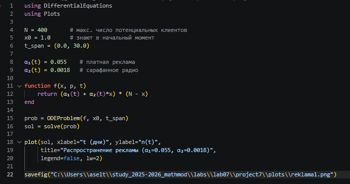
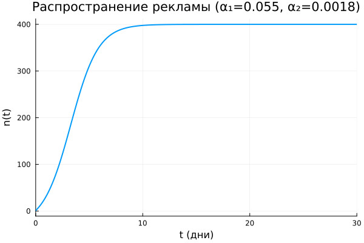
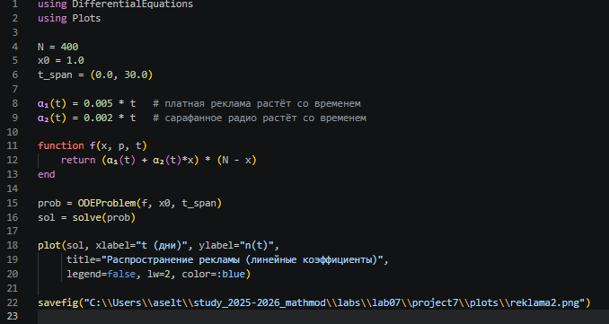
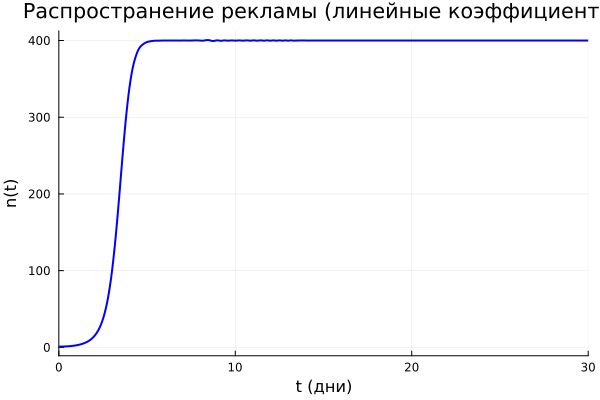
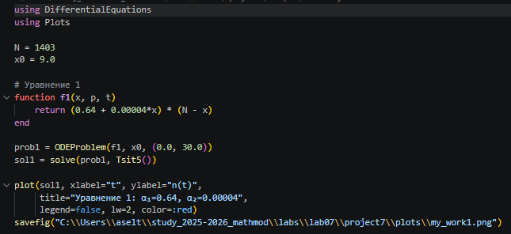
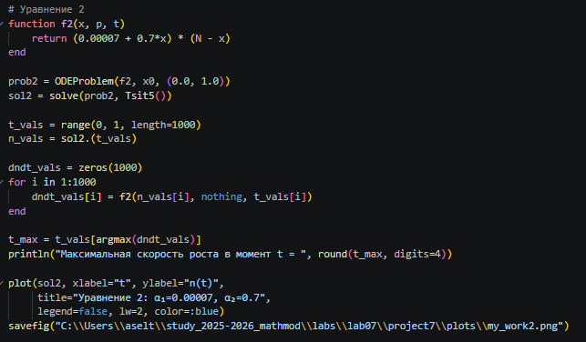
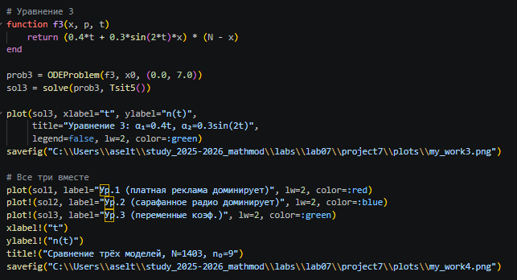
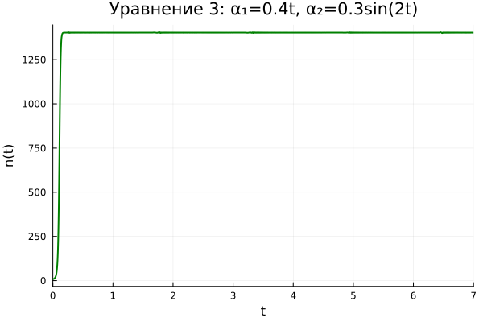
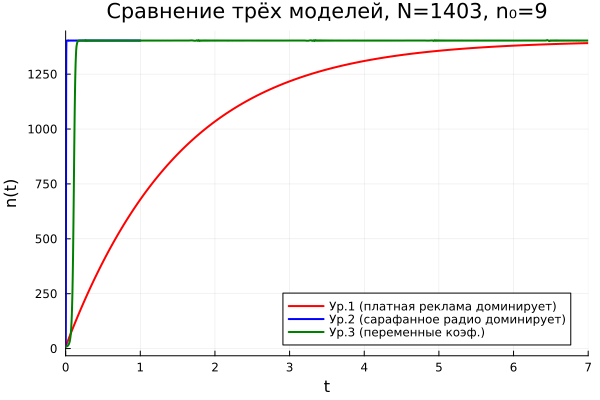

---
## Author
author:
  name: Тойчубекова Асель Нурановна
  degrees: DSc
  orcid: 0000-0002-0877-7063
  email: kulyabov-ds@rudn.ru
  affiliation:
    - name: Российский университет дружбы народов
      country: Российская Федерация
      postal-code: 117198
      city: Москва
      address: ул. Миклухо-Маклая, д. 6
## Title
title: Лабораторная работа №7
subtitle: Математическое моделирование 
license: CC BY
date: today
date-format: "YYYY-MM-DD" # Example: 2025-09-06
---

# Информация

## Докладчик

:::::::::::::: {.columns align=center}
::: {.column width="70%"}

  * Тойчубекова Асель Нурлановна
  * Студент 3 курса
  * факультет физико-математических и ествественных наук
  * Российский университет дружбы народов им. П. Лумумбы
  * [1032235033@rudn.ru](mailto:1032235033@rudn.ru)
  * <https://yamadharma.github.io/ru/>

:::
::: {.column width="30%"}

:::
::::::::::::::

# Цель работы

## Цель работы

Целью данной лабораторной работы является изучить математическую модель распространения рекламы и исследовать влияние рекламной кампании на изменение числа потенциальных клиентов во времени.

# Задание

## Задание

- Освоить построение математической модели рекламной кампании;
- Изучить логистическую модель распространения информации;
- Проанализировать влияние коэффициентов рекламы и «сарафанного радио»;
- Исследовать динамику роста числа клиентов;
- Построить и сравнить графики решений при различных значениях параметров модели.

# Теоретическое введение

## Теоретическое введение

Реклама играет важную роль в продвижении товаров и услуг на рынке. Основная цель рекламной кампании заключается в увеличении прибыли за счёт роста числа покупателей. На начальном этапе затраты на рекламу могут превышать доходы, поскольку лишь небольшая часть потенциальных клиентов осведомлена о товаре. Однако по мере распространения информации количество покупателей увеличивается, что приводит к росту прибыли. Со временем рынок насыщается, и эффективность рекламы начинает снижаться.

## Теоретическое введение

Рассмотрим процесс распространения информации о товаре среди потенциальных покупателей. Пусть общее число возможных покупателей равно (N). В момент времени (t) число людей, знающих о товаре и готовых его приобрести, обозначается через (n(t)). Тогда количество людей, не осведомлённых о товаре, равно (N - n(t)).

## Теоретическое введение

Распространение информации осуществляется двумя основными способами:

1. **За счёт рекламной кампании** — через телевидение, радио, интернет и другие средства массовой информации;
2. **За счёт межличностного общения** — когда покупатели, уже знающие о товаре, передают информацию другим людям.

Скорость изменения числа покупателей, узнавших о товаре, обозначается как:

$$
\frac{dn}{dt}
$$

## Теоретическое введение

Интенсивность рекламной кампании характеризуется коэффициентом $\alpha_1(t)$, который зависит от затрат на рекламу в данный момент времени. Вклад рекламы в увеличение числа информированных покупателей пропорционален количеству людей, ещё не знающих о товаре:

$$
\alpha_1(t)(N - n(t))
$$

## Теоретическое введение

Кроме того, распространение информации происходит за счёт общения между людьми. Этот процесс описывается коэффициентом $\alpha_2(t)$, а соответствующий вклад зависит как от числа информированных покупателей, так и от числа неосведомлённых:

$$
\alpha_2(t)n(t)(N - n(t))
$$

## Теоретическое введение

В результате математическая модель распространения рекламы описывается следующим дифференциальным уравнением:

$$
\frac{dn}{dt} = (\alpha_1(t) + \alpha_2(t)n(t))(N - n(t))
$$

Данная модель позволяет анализировать влияние рекламы на распространение информации о товаре и оценивать динамику роста числа потенциальных покупателей. 

# Выполнение лабораторной работы

## Выполнение лабораторной работы

Перед тем как приступить к выполнению задания для самостоятельной работы по вариантам, рассмотрим примеры, которые предложены в лабораторной работе. 

29 января в городе открылся новый салон красоты. Предполагается, что на момент открытия о салоне знали (N_0) потенциальных клиентов. По маркетинговым исследованиям известно, что в районе проживают (N) потенциальных клиентов. После открытия салона руководство запускает активную рекламную кампанию. Скорость изменения числа людей, знающих о салоне, пропорциональна как числу уже информированных клиентов, так и числу людей, ещё не знающих о салоне.

Необходимо исследовать математическую модель распространения рекламы и проанализировать влияние параметров рекламной кампании на скорость распространения информации. 

## Выполнение лабораторной работы

Пример 1.  

Построение решения распространения информации о товаре путем платной рекламы и с учетом «сарафанного радио» (функции, отвечающие за распространение рекламы, постоянны).

{width=60%}

## Выполнение лабораторной работы

На выходе получаем график изменения n (люди осведомленные о салоне красоты в момент времени t). 

{width=70%}

## Выполнение лабораторной работы

Далее рассмотрим пример 2:

Построение решения распространения информации о товаре путем платной рекламы и с учетом «сарафанного радио» (функции, отвечающие за 
распространение рекламы, линейны).

{width=60%}

## Выполнение лабораторной работы

В итоге получаем график. 

{width=70%}

Мы видим, что оба графика постепенно растут и в конце достигают стабильности.

## Выполнение лабораторной работы

Теперь выполним задание по вариантам. 

Мой студенческий билет-1032235033, из чего следует, что мой вариант 54.

** Вариант № 54 **

Постройте график распространения рекламы, математическая модель которой описывается следующим уравнением:

1.

$$
\frac{dn}{dt} =
(0.64 + 0.00004n(t))(N - n(t))
$$

2.

$$
\frac{dn}{dt} =
(0.00007 + 0.7n(t))(N - n(t))
$$

## Выполнение лабораторной работы

3.

$$
\frac{dn}{dt} =
(0.4 + 0.3\sin(2t)n(t))(N - n(t))
$$

При этом объем аудитории:

$$
N = 1403
$$

в начальный момент о товаре знает:

$$
n(0) = 9
$$

Для случая 2 определить, в какой момент времени скорость распространения рекламы будет иметь максимальное значение.

## Выполнение лабораторной работы

:::::::::::::: {.columns}
::: {.column width="50%"}

:::

::: {.column width="50%"}

:::
::::::::::::::

## Выполнение лабораторной работы

{width=60%}

## Выполнение лабораторной работы

Для каждого из вариантов математической модели представленной в лабораторной работе, была написана функция с соответствующими параметрами.Также из-за в того что функция вариантов 2 и 3 быстро возрастали было приято решение, для 2 варинта рассматривать интервал времени от 0 до 1, а для 3 варианта от 0 до 7.

## Выполнение лабораторной работы

В итоге получили следующе графики.

Первый вариант с коэфициентами alpha_1=0.64 и alpha_2=0.00004. 

{#fig-003 width=70%}

Из за того что а1>a2, получается модель типа модели Мальтуса.

## Выполнение лабораторной работы

Второй вариант с коэциентами 0.00007 и 0.7.

{width=70%}

## Выполнение лабораторной работы

Также во втором варианте нужно было вывести в какой момент времени скорость распространения рекламы будет иметь максимальное значение. Подставляя полученные из формулы значения n в исходную формулу вычисляем максимальную скорость. 

{width=70%}

## Выполнение лабораторной работы

Третий вариант с коэфициентами 0.4*t и 0.3*sin(2*t).

{width=70%}

## Выполнение лабораторной работы

И в результате получаем три разных графика распрастранения информации с помощью рекламы и сарафанного радио. ([рис. @fig-007]).

{#fig-007 width=70%}

## Вывод

В ходе лабораторной работы была изучена математическая модель распространения рекламы. Были рассмотрены основные закономерности распространения информации о товаре среди потенциальных клиентов и исследовано влияние рекламной кампании на скорость увеличения числа покупателей.

В процессе работы были построены графики для различных вариантов модели и проведён анализ влияния коэффициентов (\alpha_1(t)) и (\alpha_2(t)) на динамику распространения рекламы. Установлено, что при увеличении интенсивности платной рекламы рост числа информированных клиентов происходит быстрее, а при преобладании эффекта «сарафанного радио» распространение информации носит логистический характер.

