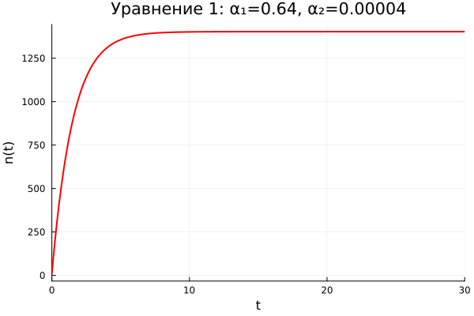
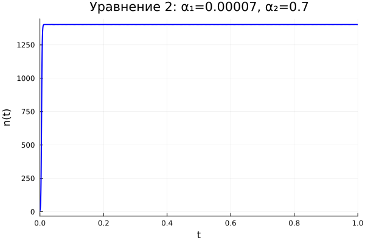
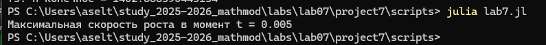

---
## Author
author:
  name: Тойчубекова Асель Нурлановна
  degrees: DSc
  orcid: 0000-0002-0877-7063
  email: kulyabov-ds@rudn.ru
  affiliation:
    - name: Российский университет дружбы народов
      country: Российская Федерация
      postal-code: 117198
      city: Москва
      address: ул. Миклухо-Маклая, д. 6

## Title
title: "Лабораторная работа №7"
subtitle: "Математическое моделирование"
license: "CC BY"
---

# Цель работы

Целью данной лабораторной работы является изучить математическую модель распространения рекламы и исследовать влияние рекламной кампании на изменение числа потенциальных клиентов во времени.

# Задание

- Освоить построение математической модели рекламной кампании;
- Изучить логистическую модель распространения информации;
- Проанализировать влияние коэффициентов рекламы и «сарафанного радио»;
- Исследовать динамику роста числа клиентов;
- Построить и сравнить графики решений при различных значениях параметров модели.

# Теоретическое введение

Реклама играет важную роль в продвижении товаров и услуг на рынке. Основная цель рекламной кампании заключается в увеличении прибыли за счёт роста числа покупателей. На начальном этапе затраты на рекламу могут превышать доходы, поскольку лишь небольшая часть потенциальных клиентов осведомлена о товаре. Однако по мере распространения информации количество покупателей увеличивается, что приводит к росту прибыли. Со временем рынок насыщается, и эффективность рекламы начинает снижаться.

Рассмотрим процесс распространения информации о товаре среди потенциальных покупателей. Пусть общее число возможных покупателей равно (N). В момент времени (t) число людей, знающих о товаре и готовых его приобрести, обозначается через (n(t)). Тогда количество людей, не осведомлённых о товаре, равно (N - n(t)).

Распространение информации осуществляется двумя основными способами:

1. **За счёт рекламной кампании** — через телевидение, радио, интернет и другие средства массовой информации;
2. **За счёт межличностного общения** — когда покупатели, уже знающие о товаре, передают информацию другим людям.

Скорость изменения числа покупателей, узнавших о товаре, обозначается как:

$$
\frac{dn}{dt}
$$

Интенсивность рекламной кампании характеризуется коэффициентом $\alpha_1(t)$, который зависит от затрат на рекламу в данный момент времени. Вклад рекламы в увеличение числа информированных покупателей пропорционален количеству людей, ещё не знающих о товаре:

$$
\alpha_1(t)(N - n(t))
$$

Кроме того, распространение информации происходит за счёт общения между людьми. Этот процесс описывается коэффициентом $\alpha_2(t)$, а соответствующий вклад зависит как от числа информированных покупателей, так и от числа неосведомлённых:

$$
\alpha_2(t)n(t)(N - n(t))
$$

В результате математическая модель распространения рекламы описывается следующим дифференциальным уравнением:

$$
\frac{dn}{dt} = (\alpha_1(t) + \alpha_2(t)n(t))(N - n(t))
$$

Данная модель позволяет анализировать влияние рекламы на распространение информации о товаре и оценивать динамику роста числа потенциальных покупателей. При определённых соотношениях коэффициентов модель может переходить в частные случаи, например в модель Мальтуса, описывающую экспоненциальный рост.

# Выполнение лабораторной работы

Перед тем как приступить к выполнению задания для самостоятельной работы по вариантам, рассмотрим примеры, которые предложены в лабораторной работе. 

29 января в городе открылся новый салон красоты. Предполагается, что на момент открытия о салоне знали (N_0) потенциальных клиентов. По маркетинговым исследованиям известно, что в районе проживают (N) потенциальных клиентов. После открытия салона руководство запускает активную рекламную кампанию. Скорость изменения числа людей, знающих о салоне, пропорциональна как числу уже информированных клиентов, так и числу людей, ещё не знающих о салоне.

Необходимо исследовать математическую модель распространения рекламы и проанализировать влияние параметров рекламной кампании на скорость распространения информации. 

Пример 1.  

Построение решения распространения информации о товаре путем платной рекламы и с учетом «сарафанного радио» (функции, отвечающие за распространение рекламы, постоянны).

Код на julia:
```julia
using DifferentialEquations
using Plots

N = 400       # макс. число потенциальных клиентов
x0 = 1.0      # знают в начальный момент
t_span = (0.0, 30.0)

α₁(t) = 0.055    # платная реклама
α₂(t) = 0.0018   # сарафанное радио

function f(x, p, t)
    return (α₁(t) + α₂(t)*x) * (N - x)
end

prob = ODEProblem(f, x0, t_span)
sol = solve(prob)

plot(sol, xlabel="t (дни)", ylabel="n(t)", 
     title="Распространение рекламы (α₁=0.055, α₂=0.0018)",
     legend=false, lw=2)

savefig("C:\\Users\\aselt\\study_2025-2026_mathmod\\labs\\lab07\\project7\\plots\\reklama1.png")

```

На выходе получаем график изменения n (люди осведомленные о салоне красоты в момент времени t). ([рис. @fig-001]).

{#fig-001 width=70%}

Далее рассмотрим пример 2:
Построение решения распространения информации о товаре путем платной рекламы и с учетом «сарафанного радио» (функции, отвечающие за 
распространение рекламы, линейны).

Код на julia:

```julia
using DifferentialEquations
using Plots

N = 400
x0 = 1.0
t_span = (0.0, 30.0)

α₁(t) = 0.005 * t   # платная реклама растёт со временем
α₂(t) = 0.002 * t   # сарафанное радио растёт со временем

function f(x, p, t)
    return (α₁(t) + α₂(t)*x) * (N - x)
end

prob = ODEProblem(f, x0, t_span)
sol = solve(prob)

plot(sol, xlabel="t (дни)", ylabel="n(t)",
     title="Распространение рекламы (линейные коэффициенты)",
     legend=false, lw=2, color=:blue)

savefig("C:\\Users\\aselt\\study_2025-2026_mathmod\\labs\\lab07\\project7\\plots\\reklama2.png")
```

В итоге получаем график. ([рис. @fig-002]).

{#fig-002 width=70%}


Мы видим, что оба графика постепенно растут и в конце достигают стабильности.

Теперь выполним задание по вариантам. 

Мой студенческий билет-1032235033, из чего следует, что мой вариант 54.

** Вариант № 54 **

Постройте график распространения рекламы, математическая модель которой описывается следующим уравнением:

1.

$$
\frac{dn}{dt} =
(0.64 + 0.00004n(t))(N - n(t))
$$

2.

$$
\frac{dn}{dt} =
(0.00007 + 0.7n(t))(N - n(t))
$$

3.

$$
\frac{dn}{dt} =
(0.4 + 0.3\sin(2t)n(t))(N - n(t))
$$

При этом объем аудитории:

$$
N = 1403
$$

в начальный момент о товаре знает:

$$
n(0) = 9
$$

Для случая 2 определить, в какой момент времени скорость распространения рекламы будет иметь максимальное значение.

Для решения этой задачи был написан код на julia:

```julia
using DifferentialEquations
using Plots

N = 1403
x0 = 9.0

# Уравнение 1
function f1(x, p, t)
    return (0.64 + 0.00004*x) * (N - x)
end

prob1 = ODEProblem(f1, x0, (0.0, 30.0))
sol1 = solve(prob1, Tsit5())

plot(sol1, xlabel="t", ylabel="n(t)",
     title="Уравнение 1: α₁=0.64, α₂=0.00004",
     legend=false, lw=2, color=:red)
savefig("C:\\Users\\aselt\\study_2025-2026_mathmod\\labs\\lab07\\project7\\plots\\my_work1.png")

# Уравнение 2
function f2(x, p, t)
    return (0.00007 + 0.7*x) * (N - x)
end

prob2 = ODEProblem(f2, x0, (0.0, 1.0))
sol2 = solve(prob2, Tsit5())

t_vals = range(0, 1, length=1000)
n_vals = sol2.(t_vals)

dndt_vals = zeros(1000)
for i in 1:1000
    dndt_vals[i] = f2(n_vals[i], nothing, t_vals[i])
end

t_max = t_vals[argmax(dndt_vals)]
println("Максимальная скорость роста в момент t = ", round(t_max, digits=4))

plot(sol2, xlabel="t", ylabel="n(t)",
     title="Уравнение 2: α₁=0.00007, α₂=0.7",
     legend=false, lw=2, color=:blue)
savefig("C:\\Users\\aselt\\study_2025-2026_mathmod\\labs\\lab07\\project7\\plots\\my_work2.png")

# Уравнение 3
function f3(x, p, t)
    return (0.4*t + 0.3*sin(2*t)*x) * (N - x)
end

prob3 = ODEProblem(f3, x0, (0.0, 7.0))
sol3 = solve(prob3, Tsit5())

plot(sol3, xlabel="t", ylabel="n(t)",
     title="Уравнение 3: α₁=0.4t, α₂=0.3sin(2t)",
     legend=false, lw=2, color=:green)
savefig("C:\\Users\\aselt\\study_2025-2026_mathmod\\labs\\lab07\\project7\\plots\\my_work3.png")

# Все три вместе
plot(sol1, label="Ур.1 (платная реклама доминирует)", lw=2, color=:red)
plot!(sol2, label="Ур.2 (сарафанное радио доминирует)", lw=2, color=:blue)
plot!(sol3, label="Ур.3 (переменные коэф.)", lw=2, color=:green)
xlabel!("t")
ylabel!("n(t)")
title!("Сравнение трёх моделей, N=1403, n₀=9")
savefig("C:\\Users\\aselt\\study_2025-2026_mathmod\\labs\\lab07\\project7\\plots\\my_work4.png")
```

Для каждого из вариантов математической модели представленной в лабораторной работе, была написана функция с соответствующими параметрами.Также из-за в того что функция вариантов 2 и 3 быстро возрастали было приято решение, для 2 варинта рассматривать интервал времени от 0 до 1, а для 3 варианта от 0 до 7.

В итоге получили следующе графики.

Первый вариант с коэфициентами alpha_1=0.64 и alpha_2=0.00004. ([рис. @fig-003]).

{#fig-003 width=70%}

Из за того что а1>a2, получается модель типа модели Мальтуса.

Второй вариант с коэциентами 0.00007 и 0.7. ([рис. @fig-004]).

{#fig-004 width=70%}

Также во втором варианте нужно было вывести в какой момент времени скорость распространения рекламы будет иметь максимальное значение. Подставляя полученные из формулы значения n в исходную формулу вычисляем максимальную скорость. ([рис. @fig-005]).

{#fig-005 width=70%}

Третий вариант с коэфициентами 0.4*t и 0.3*sin(2*t).([рис. @fig-006]).

{#fig-006 width=70%}

И в результате получаем три разных графика распрастранения информации с помощью рекламы и сарафанного радио. ([рис. @fig-007]).

{#fig-007 width=70%}

# Вывод

В ходе лабораторной работы была изучена математическая модель распространения рекламы. Были рассмотрены основные закономерности распространения информации о товаре среди потенциальных клиентов и исследовано влияние рекламной кампании на скорость увеличения числа покупателей.

В процессе работы были построены графики для различных вариантов модели и проведён анализ влияния коэффициентов (\alpha_1(t)) и (\alpha_2(t)) на динамику распространения рекламы. Установлено, что при увеличении интенсивности платной рекламы рост числа информированных клиентов происходит быстрее, а при преобладании эффекта «сарафанного радио» распространение информации носит логистический характер.


