---
## Author
author:
  name: Тойчубекова Асель Нурановна
  degrees: DSc
  orcid: 0000-0002-0877-7063
  email: kulyabov-ds@rudn.ru
  affiliation:
    - name: Российский университет дружбы народов
      country: Российская Федерация
      postal-code: 117198
      city: Москва
      address: ул. Миклухо-Маклая, д. 6
## Title
title: Лабораторная работа №8
subtitle: Математическое моделирование 
license: CC BY
date: today
date-format: "YYYY-MM-DD" # Example: 2025-09-06
---

# Информация

## Докладчик

:::::::::::::: {.columns align=center}
::: {.column width="70%"}

  * Тойчубекова Асель Нурлановна
  * Студент 3 курса
  * факультет физико-математических и ествественных наук
  * Российский университет дружбы народов им. П. Лумумбы
  * [1032235033@rudn.ru](mailto:1032235033@rudn.ru)

:::
::: {.column width="30%"}

:::
::::::::::::::

# Цель работы

## Цель работы

Целью данной лабораторной работы является освоение методов математического моделирования экономических процессов на примере модели конкуренции фирм, провести численный анализ динамики оборотных средств предприятий и изучить условия их устойчивого функционирования и банкротства.

# Задание

## Задание

- Освоить построение математической модели конкуренции фирм;
- Выполнить примеры из лабораторной работы;
- Выполнить задание по вариантам; 

# Теоретическое введение

## Теоретическое введение

В данной лабораторной работе рассматривается математическая модель конкуренции двух фирм, производящих взаимозаменяемые товары одинакового качества в одной рыночной нише.

За основу берётся модель одной фирмы, производящей товар долговременного пользования, цена которого определяется балансом спроса и предложения. Предполагается, что все потребители имеют одинаковый доход, что соответствует ориентации товара на определённый слой населения.

## Теоретическое введение

Функция спроса имеет пороговый характер и описывается формулой:

$$Q = q\left(1 - \frac{p}{p_{cr}}\right)$$

где q — максимальная потребность одного потребителя в единицу времени, p — рыночная цена, p_cr — критическая цена, при которой спрос обращается в ноль. При p ≥ p_cr потребители полностью отказываются от покупки товара.

## Теоретическое введение

Динамика оборотных средств одной фирмы описывается уравнением:

$$\frac{dM}{dt} = -\frac{M\delta}{\tau} + NQp - \kappa$$

Первый член отражает затраты на производство, второй — выручку от продаж, третий — постоянные издержки. Рыночная цена стремится к равновесному значению значительно быстрее, чем меняются оборотные средства, поэтому уравнение для цены заменяется алгебраическим соотношением, из которого следует равновесная цена:

$$p = p_{cr}\left(1 - \frac{M\delta}{\tau \tilde{p} N q}\right)$$

## Теоретическое введение

Система имеет два стационарных состояния: устойчивое M₊, соответствующее стабильной работе фирмы, и неустойчивое M₋, соответствующее минимальному начальному капиталу для входа на рынок. При M < M₋ фирма идёт к банкротству.

При рассмотрении конкуренции двух фирм рыночная цена определяется суммарным предложением обеих фирм. После введения нормировки t = c₁θ и пренебрежения постоянными издержками система уравнений принимает вид:

$$\frac{dM_1}{d\theta} = M_1 - \frac{b}{c_1}M_1 M_2 - \frac{a_1}{c_1}M_1^2$$

$$\frac{dM_2}{d\theta} = \frac{c_2}{c_1}M_2 - \frac{b}{c_1}M_1 M_2 - \frac{a_2}{c_1}M_2^2$$

## Теоретическое введение

где коэффициенты определяются параметрами производства каждой фирмы:

$$a_1 = \frac{p_{cr}}{\tau_1^2 \tilde{p}_1^2 N q}, \quad a_2 = \frac{p_{cr}}{\tau_2^2 \tilde{p}_2^2 N q}, \quad b = \frac{p_{cr}}{\tau_1^2 \tilde{p}_1^2 \tau_2^2 \tilde{p}_2^2 N q}$$

$$c_1 = \frac{p_{cr} - \tilde{p}_1}{\tau_1 \tilde{p}_1}, \quad c_2 = \frac{p_{cr} - \tilde{p}_2}{\tau_2 \tilde{p}_2}$$

Члены M₁² и M₂² отражают ограниченность рынка, а член M₁M₂ — конкурентное взаимодействие между фирмами.

## Теоретическое введение

Рассматриваются два случая. В **первом случае** конкуренция ведётся исключительно рыночными методами — через изменение себестоимости и длительности производственного цикла. Коэффициент перед M₁M₂ одинаков в обоих уравнениях, обе фирмы независимо выходят на свои стационарные значения оборотных средств и сосуществуют на рынке.

## Теоретическое введение

Во **втором случае** помимо экономических факторов используются социально-психологические методы — формирование общественного предпочтения одного товара другому независимо от его качества и цены. Это выражается в увеличении коэффициента перед M₁M₂ в уравнении для фирмы 1, что приводит к усиленному конкурентному давлению на неё.

# Выполнение лабораторной работы

## Выполнение лабораторной работы

Перед тем как приступить к выполнению задания для самостоятельной работы по вариантам, рассмотрим примеры, которые предложены в лабораторной работе. 
Для начала рассмотрим первый случай, когда конкуренция ведётся исключительно рыночными методами. 

:::::::::::::: {.columns}
::: {.column width="20%"}
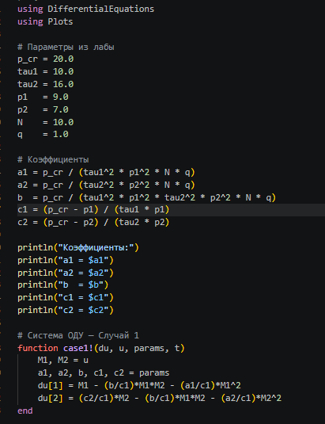
:::

::: {.column width="30%"}
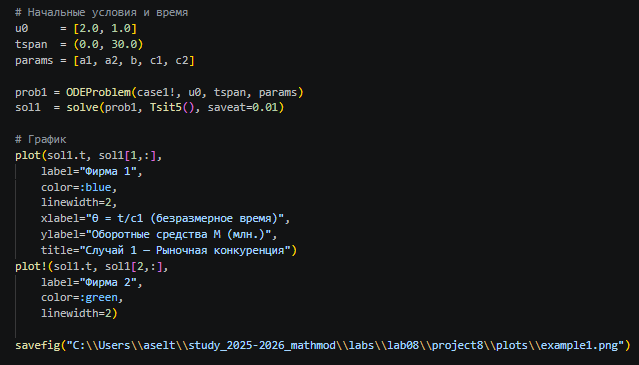
:::
::::::::::::::

## Выполнение лабораторной работы

На выходе получаем график, которая показывает динамику оборотных средств предприятий.

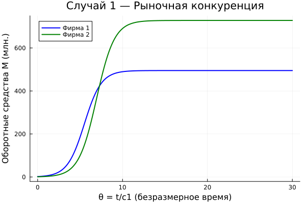{width=60%}

## Выполнение лабораторной работы

Далее рассмотрим второй случай, когда помимо экономических факторов используются социально-психологические методы. Функции остаются такими же, но добавляется коеффициент перед M₁M₂, 0.002

:::::::::::::: {.columns}
::: {.column width="20%"}
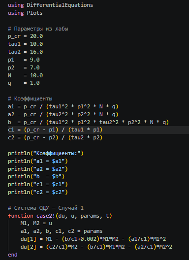
:::

::: {.column width="30%"}
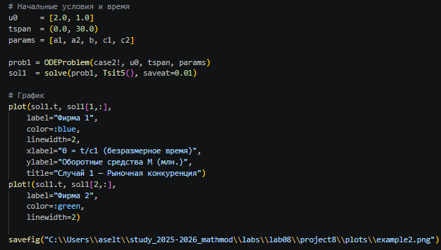
:::
::::::::::::::

## Выполнение лабораторной работы

В итоге получаем график изменение облора фирмы с учетом социально-физических факторов. 

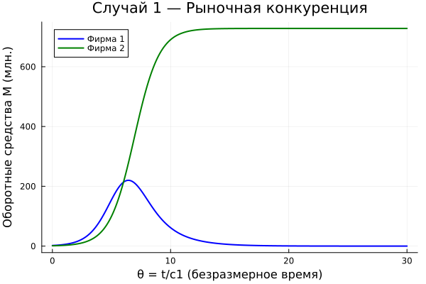{width=60%}

## Выполнение лабораторной работы

Далее нам предлагалось придумать свой пример двух конкурирующих фирм с идентичным товаром, задать начальные значения и известные составляющие. Построить графики изменения объемов оборотных средств каждой фирмы. Рассмотреть два случая. Проанализировать полученные результаты. Найти стационарное состояние системы для первого случая. 

## Выполнение лабораторной работы

Для первого случая был написан следующий код:

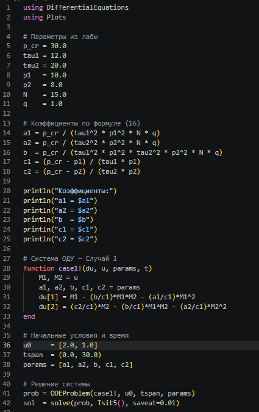{width=20%}

## Выполнение лабораторной работы

:::::::::::::: {.columns}
::: {.column width="30%"}
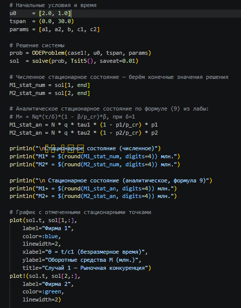
:::

::: {.column width="40%"}

:::
::::::::::::::

## Выполнение лабораторной работы

В коде мы прописали свои значения параметров и начальные значения оборота фирм, также добавили кусок с расчетом стационарного состояния.
В выводе мы получили значение стационарного состояния, что совпадала с конечным значением оборота. 

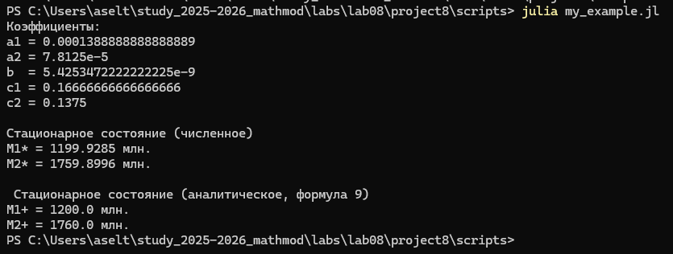{width=60%}

## Выполнение лабораторной работы

Также получили график изменения оборота двух фирм, которая похоже на график, полученный в первом примере, оборот двух фирм растет и достигает стабильности. 

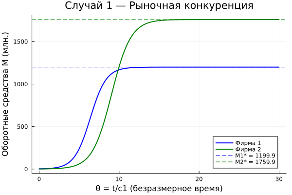{width=60%}

## Выполнение лабораторной работы

Теперь перейдем к случаю 2, параметры и начальное значение оборотов остается неизменными, только добавляется коеффициент социально-психологоческого фактора.

:::::::::::::: {.columns}
::: {.column width="20%"}
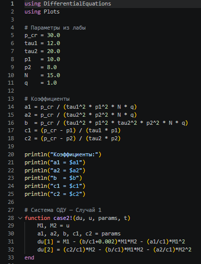
:::

::: {.column width="30%"}
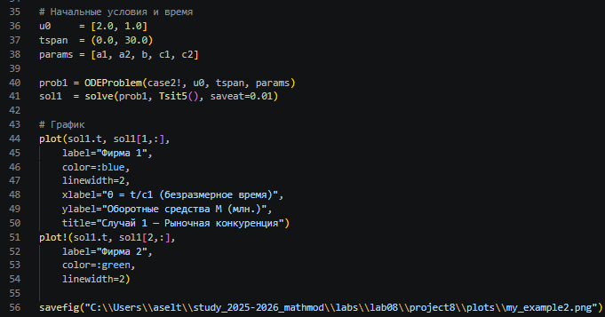
:::
::::::::::::::

## Выполнение лабораторной работы

На выходе получаем график, где у фирмы 2 как и в случае 1 оборот растет со временем и достигает стабильности, а оборот фирмы один сперва немного растет на равне со второй, но идет на спад и вскоре достигает 0, то есть бонкротства.

{width=50%}

## Выполнение лабораторной работы

Мой студенческий билет-1032235033, из чего следует, что мой вариант 54.

Задание:

1. Построить графики изменения оборотных средств фирмы 1 и фирмы 2 без учёта постоянных издержек и с введённой нормировкой для **случая 1**.

2. Построить графики изменения оборотных средств фирмы 1 и фирмы 2 без учёта постоянных издержек и с введённой нормировкой для **случая 2**.

## Выполнение лабораторной работы

Для обоих случаев используются следующие начальные условия:

$$
M_1(0)=7.7,
\qquad
M_2(0)=9.7.
$$

Параметры модели:

$$
p_{cr}=47,
\qquad
N=50,
\qquad
q=1,
$$

$$
\tau_1=33,
\qquad
\tau_2=27,
$$

$$
\tilde p_1=9.7,
\qquad
\tilde p_2=11.7.
$$

## Выполнение лабораторной работы

Для решения этой задачи был написан код на для первого случая с заданными параметрами и начальными оборотами:

:::::::::::::: {.columns}
::: {.column width="20%"}
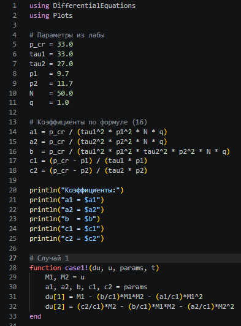
:::

::: {.column width="30%"}
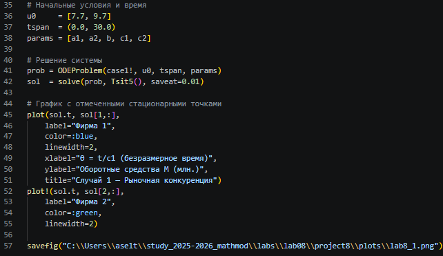
:::
::::::::::::::

## Выполнение лабораторной работы

Получаем график характерный для случая бее доп фактора. Две фирмы идут на равне с друг другом, в какой то момент фирма 1 обгоняет фирму 2, потому что у фирмы 2 скорость цикла производства меньне чем у 1. Они оба достигают стабильности.

{width=60%}

## Выполнение лабораторной работы

Теперь напишем код для случая два. Код аохож на первый, но нам задан коеффициент социально-психологтческого фактора=0.00044.

:::::::::::::: {.columns}
::: {.column width="20%"}
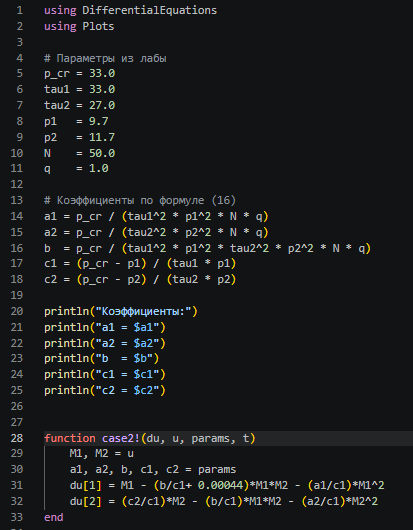
:::

::: {.column width="30%"}

:::
::::::::::::::

## Выполнение лабораторной работы

Получаем график, который показывает, что фирма 1 росла с фирмой 2, но быстро обонкротилась.

{width=60%}

# Вывод

## Вывод

В ходе выполнения лабораторной работе №8 я освоила методов математического моделирования экономических процессов на примере модели конкуренции фирм, провела численный анализ динамики оборотных средств предприятий и изучила условия их устойчивого функционирования и банкротства.

