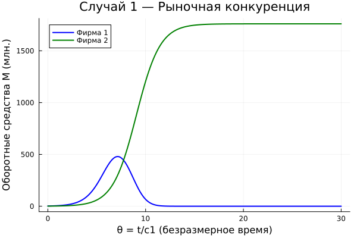
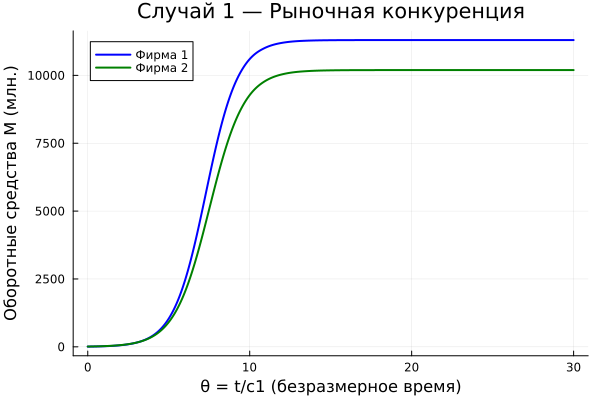
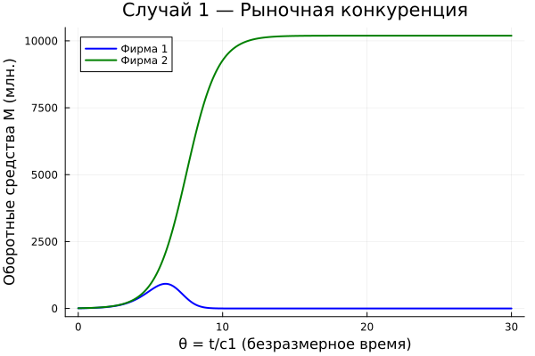

---
## Author
author:
  name: Тойчубекова Асель Нурлановна
  degrees: DSc
  orcid: 0000-0002-0877-7063
  email: 1032235033@rudn.ru
  affiliation:
    - name: Российский университет дружбы народов
      country: Российская Федерация
      postal-code: 117198
      city: Москва
      address: ул. Миклухо-Маклая, д. 6

## Title
title: "Лабораторная работа №8"
subtitle: "Математическое моделирование"
license: "CC BY"
---

# Цель работы

Целью данной лабораторной работы является освоение методов математического моделирования экономических процессов на примере модели конкуренции фирм, провести численный анализ динамики оборотных средств предприятий и изучить условия их устойчивого функционирования и банкротства.

# Задание

- Освоить построение математической модели конкуренции фирм;
- Выполнить примеры из лабораторной работы;
- Выполнить задание по вариантам;

# Теоретическое введение

В данной лабораторной работе рассматривается математическая модель конкуренции двух фирм, производящих взаимозаменяемые товары одинакового качества в одной рыночной нише.

За основу берётся модель одной фирмы, производящей товар долговременного пользования, цена которого определяется балансом спроса и предложения. Предполагается, что все потребители имеют одинаковый доход, что соответствует ориентации товара на определённый слой населения.

Функция спроса имеет пороговый характер и описывается формулой:

$$Q = q\left(1 - \frac{p}{p_{cr}}\right)$$

где q — максимальная потребность одного потребителя в единицу времени, p — рыночная цена, p_cr — критическая цена, при которой спрос обращается в ноль. При p ≥ p_cr потребители полностью отказываются от покупки товара.

Динамика оборотных средств одной фирмы описывается уравнением:

$$\frac{dM}{dt} = -\frac{M\delta}{\tau} + NQp - \kappa$$

Первый член отражает затраты на производство, второй — выручку от продаж, третий — постоянные издержки. Рыночная цена стремится к равновесному значению значительно быстрее, чем меняются оборотные средства, поэтому уравнение для цены заменяется алгебраическим соотношением, из которого следует равновесная цена:

$$p = p_{cr}\left(1 - \frac{M\delta}{\tau \tilde{p} N q}\right)$$

Система имеет два стационарных состояния: устойчивое M₊, соответствующее стабильной работе фирмы, и неустойчивое M₋, соответствующее минимальному начальному капиталу для входа на рынок. При M < M₋ фирма идёт к банкротству.

При рассмотрении конкуренции двух фирм рыночная цена определяется суммарным предложением обеих фирм. После введения нормировки t = c₁θ и пренебрежения постоянными издержками система уравнений принимает вид:

$$\frac{dM_1}{d\theta} = M_1 - \frac{b}{c_1}M_1 M_2 - \frac{a_1}{c_1}M_1^2$$

$$\frac{dM_2}{d\theta} = \frac{c_2}{c_1}M_2 - \frac{b}{c_1}M_1 M_2 - \frac{a_2}{c_1}M_2^2$$

где коэффициенты определяются параметрами производства каждой фирмы:

$$a_1 = \frac{p_{cr}}{\tau_1^2 \tilde{p}_1^2 N q}, \quad a_2 = \frac{p_{cr}}{\tau_2^2 \tilde{p}_2^2 N q}, \quad b = \frac{p_{cr}}{\tau_1^2 \tilde{p}_1^2 \tau_2^2 \tilde{p}_2^2 N q}$$

$$c_1 = \frac{p_{cr} - \tilde{p}_1}{\tau_1 \tilde{p}_1}, \quad c_2 = \frac{p_{cr} - \tilde{p}_2}{\tau_2 \tilde{p}_2}$$

Члены M₁² и M₂² отражают ограниченность рынка, а член M₁M₂ — конкурентное взаимодействие между фирмами.

Рассматриваются два случая. В **первом случае** конкуренция ведётся исключительно рыночными методами — через изменение себестоимости и длительности производственного цикла. Коэффициент перед M₁M₂ одинаков в обоих уравнениях, обе фирмы независимо выходят на свои стационарные значения оборотных средств и сосуществуют на рынке.

Во **втором случае** помимо экономических факторов используются социально-психологические методы — формирование общественного предпочтения одного товара другому независимо от его качества и цены. Это выражается в увеличении коэффициента перед M₁M₂ в уравнении для фирмы 1, что приводит к усиленному конкурентному давлению на неё. В результате фирма 1, несмотря на начальный рост, достигает максимума и начинает нести убытки, в итоге терпя банкротство, тогда как фирма 2 захватывает весь рынок.

# Выполнение лабораторной работы 

Перед тем как приступить к выполнению задания для самостоятельной работы по вариантам, рассмотрим примеры, которые предложены в лабораторной работе. 
Для начала рассмотрим первый случай, когда конкуренция ведётся исключительно рыночными методами. Используем функции для расчета оборота:

$$\frac{dM_1}{d\theta} = M_1 - \frac{b}{c_1}M_1 M_2 - \frac{a_1}{c_1}M_1^2$$

$$\frac{dM_2}{d\theta} = \frac{c_2}{c_1}M_2 - \frac{b}{c_1}M_1 M_2 - \frac{a_2}{c_1}M_2^2$$

где:


$$a_1 = \frac{p_{cr}}{\tau_1^2 \tilde{p}_1^2 N q}, \quad a_2 = \frac{p_{cr}}{\tau_2^2 \tilde{p}_2^2 N q}, \quad b = \frac{p_{cr}}{\tau_1^2 \tilde{p}_1^2 \tau_2^2 \tilde{p}_2^2 N q}$$

$$c_1 = \frac{p_{cr} - \tilde{p}_1}{\tau_1 \tilde{p}_1}, \quad c_2 = \frac{p_{cr} - \tilde{p}_2}{\tau_2 \tilde{p}_2}$$

Тогда код для первого случая с некоторыми параментрами выглядит так:  

Код на julia:
```julia
using DifferentialEquations
using Plots

# Параметры из лабы
p_cr = 20.0
tau1 = 10.0
tau2 = 16.0
p1   = 9.0
p2   = 7.0
N    = 10.0
q    = 1.0

# Коэффициенты
a1 = p_cr / (tau1^2 * p1^2 * N * q)
a2 = p_cr / (tau2^2 * p2^2 * N * q)
b  = p_cr / (tau1^2 * p1^2 * tau2^2 * p2^2 * N * q)
c1 = (p_cr - p1) / (tau1 * p1)
c2 = (p_cr - p2) / (tau2 * p2)

println("Коэффициенты:")
println("a1 = $a1")
println("a2 = $a2")
println("b  = $b")
println("c1 = $c1")
println("c2 = $c2")

# Система ОДУ — Случай 1
function case1!(du, u, params, t)
    M1, M2 = u
    a1, a2, b, c1, c2 = params
    du[1] = M1 - (b/c1)*M1*M2 - (a1/c1)*M1^2
    du[2] = (c2/c1)*M2 - (b/c1)*M1*M2 - (a2/c1)*M2^2
end

# Начальные условия и время
u0     = [2.0, 1.0]
tspan  = (0.0, 30.0)
params = [a1, a2, b, c1, c2]

prob1 = ODEProblem(case1!, u0, tspan, params)
sol1  = solve(prob1, Tsit5(), saveat=0.01)

# График
plot(sol1.t, sol1[1,:],
    label="Фирма 1",
    color=:blue,
    linewidth=2,
    xlabel="θ = t/c1 (безразмерное время)",
    ylabel="Оборотные средства M (млн.)",
    title="Случай 1 — Рыночная конкуренция")
plot!(sol1.t, sol1[2,:],
    label="Фирма 2",
    color=:green,
    linewidth=2)

savefig("C:\\Users\\aselt\\study_2025-2026_mathmod\\labs\\lab08\\project8\\plots\\example1.png")

```

На выходе получаем график, которая показывает динамику оборотных средств предприятий. ([рис. @fig-001]).

{#fig-001 width=70%}

Далее рассмотрим второй случай, когда помимо экономических факторов используются социально-психологические методы. Функции остаются такими же, но добавляется коеффициент перед M₁M₂, 0.002, это и есть так называемые социально-психологические факторы. 

Код на julia:

```julia
using DifferentialEquations
using Plots

# Параметры из лабы
p_cr = 20.0
tau1 = 10.0
tau2 = 16.0
p1   = 9.0
p2   = 7.0
N    = 10.0
q    = 1.0

# Коэффициенты
a1 = p_cr / (tau1^2 * p1^2 * N * q)
a2 = p_cr / (tau2^2 * p2^2 * N * q)
b  = p_cr / (tau1^2 * p1^2 * tau2^2 * p2^2 * N * q)
c1 = (p_cr - p1) / (tau1 * p1)
c2 = (p_cr - p2) / (tau2 * p2)

println("Коэффициенты:")
println("a1 = $a1")
println("a2 = $a2")
println("b  = $b")
println("c1 = $c1")
println("c2 = $c2")

# Система ОДУ — Случай 1
function case2!(du, u, params, t)
    M1, M2 = u
    a1, a2, b, c1, c2 = params
    du[1] = M1 - (b/c1+0.002)*M1*M2 - (a1/c1)*M1^2
    du[2] = (c2/c1)*M2 - (b/c1)*M1*M2 - (a2/c1)*M2^2
end

# Начальные условия и время
u0     = [2.0, 1.0]
tspan  = (0.0, 30.0)
params = [a1, a2, b, c1, c2]

prob1 = ODEProblem(case2!, u0, tspan, params)
sol1  = solve(prob1, Tsit5(), saveat=0.01)

# График
plot(sol1.t, sol1[1,:],
    label="Фирма 1",
    color=:blue,
    linewidth=2,
    xlabel="θ = t/c1 (безразмерное время)",
    ylabel="Оборотные средства M (млн.)",
    title="Случай 1 — Рыночная конкуренция")
plot!(sol1.t, sol1[2,:],
    label="Фирма 2",
    color=:green,
    linewidth=2)

savefig("C:\\Users\\aselt\\study_2025-2026_mathmod\\labs\\lab08\\project8\\plots\\example2.png")

```

В итоге получаем график изменение облора фирмы с учетом социально-физических факторов. Можно заметить, что оборот первой фирмы в скором счете немного увеличившись пошла на спад и обонкротилась. В пером вслучае в отличии от второго фирмы оборот фирм росли независимо от друг друг и доходили до стабильности через некоторое время. ([рис. @fig-002]).

{#fig-002 width=70%}

Далее нам предлагалось придумать свой пример двух конкурирующих фирм с идентичным товаром, задать начальные значения и известные составляющие. Построить графики изменения объемов оборотных средств каждой фирмы. Рассмотреть два случая. Проанализировать полученные результаты. Найти стационарное состояние системы для первого случая. 

Для первого случая был написан следующий код:

```julia
using DifferentialEquations
using Plots

# Параметры из лабы
p_cr = 30.0   
tau1 = 12.0  
tau2 = 20.0  
p1   = 10.0 
p2  н = 8.0    
N    = 15.0  
q    = 1.0

# Коэффициенты по формуле (16)
a1 = p_cr / (tau1^2 * p1^2 * N * q)
a2 = p_cr / (tau2^2 * p2^2 * N * q)
b  = p_cr / (tau1^2 * p1^2 * tau2^2 * p2^2 * N * q)
c1 = (p_cr - p1) / (tau1 * p1)
c2 = (p_cr - p2) / (tau2 * p2)

println("Коэффициенты:")
println("a1 = $a1")
println("a2 = $a2")
println("b  = $b")
println("c1 = $c1")
println("c2 = $c2")

# Система ОДУ — Случай 1
function case1!(du, u, params, t)
    M1, M2 = u
    a1, a2, b, c1, c2 = params
    du[1] = M1 - (b/c1)*M1*M2 - (a1/c1)*M1^2
    du[2] = (c2/c1)*M2 - (b/c1)*M1*M2 - (a2/c1)*M2^2
end

# Начальные условия и время
u0     = [2.0, 1.0]
tspan  = (0.0, 30.0)
params = [a1, a2, b, c1, c2]

# Решение системы
prob = ODEProblem(case1!, u0, tspan, params)
sol  = solve(prob, Tsit5(), saveat=0.01)

# Численное стационарное состояние — берём конечные значения решения
M1_stat_num = sol[1, end]
M2_stat_num = sol[2, end]

# Аналитическое стационарное состояние по формуле (9) из лабы:
# M+ = Nq*(τ/δ)*(1 - p̃/p_cr)*p̃, при δ=1
M1_stat_an = N * q * tau1 * (1 - p1/p_cr) * p1
M2_stat_an = N * q * tau2 * (1 - p2/p_cr) * p2

println("\nСтационарное состояние (численное)")
println("M1* = $(round(M1_stat_num, digits=4)) млн.")
println("M2* = $(round(M2_stat_num, digits=4)) млн.")

println("\n Стационарное состояние (аналитическое, формула 9)")
println("M1+ = $(round(M1_stat_an, digits=4)) млн.")
println("M2+ = $(round(M2_stat_an, digits=4)) млн.")

# График с отмеченными стационарными точками
plot(sol.t, sol[1,:],
    label="Фирма 1",
    color=:blue,
    linewidth=2,
    xlabel="θ = t/c1 (безразмерное время)",
    ylabel="Оборотные средства M (млн.)",
    title="Случай 1 — Рыночная конкуренция")
plot!(sol.t, sol[2,:],
    label="Фирма 2",
    color=:green,
    linewidth=2)

# Горизонтальные линии — стационарные состояния
hline!([M1_stat_num],
    label="M1* = $(round(M1_stat_num, digits=1))",
    color=:blue,
    linestyle=:dash,
    linewidth=1)
hline!([M2_stat_num],
    label="M2* = $(round(M2_stat_num, digits=1))",
    color=:green,
    linestyle=:dash,
    linewidth=1)
savefig("C:\\Users\\aselt\\study_2025-2026_mathmod\\labs\\lab08\\project8\\plots\\my_example1.png")

```

В коде мы прописали свои значения параметров и начальные значения оборота фирм, также добавили кусок с расчетом стационарного состояния.
В выводе мы получили значение стационарного состояния, что совпадала с конечным значением оборота ([рис. @fig-003]), также получили график изменения оборота двух фирм, которая похоже на график, полученный в первом примере, оборот двух фирм растет и достигает стабильности. ([рис. @fig-004])

{#fig-003 width=70%}

{#fig-004 width=70%}

Теперь перейдем к случаю 2, параметры и начальное значение оборотов остается неизменными, только добавляется коеффициент социально-психологоческого фактора.

Код для случая 2:

```julia
using DifferentialEquations
using Plots

# Параметры из лабы
p_cr = 30.0   
tau1 = 12.0  
tau2 = 20.0  
p1   = 10.0 
p2   = 8.0    
N    = 15.0  
q    = 1.0

# Коэффициенты
a1 = p_cr / (tau1^2 * p1^2 * N * q)
a2 = p_cr / (tau2^2 * p2^2 * N * q)
b  = p_cr / (tau1^2 * p1^2 * tau2^2 * p2^2 * N * q)
c1 = (p_cr - p1) / (tau1 * p1)
c2 = (p_cr - p2) / (tau2 * p2)

println("Коэффициенты:")
println("a1 = $a1")
println("a2 = $a2")
println("b  = $b")
println("c1 = $c1")
println("c2 = $c2")

# Система ОДУ — Случай 1
function case2!(du, u, params, t)
    M1, M2 = u
    a1, a2, b, c1, c2 = params
    du[1] = M1 - (b/c1+0.002)*M1*M2 - (a1/c1)*M1^2
    du[2] = (c2/c1)*M2 - (b/c1)*M1*M2 - (a2/c1)*M2^2
end

# Начальные условия и время
u0     = [2.0, 1.0]
tspan  = (0.0, 30.0)
params = [a1, a2, b, c1, c2]

prob1 = ODEProblem(case2!, u0, tspan, params)
sol1  = solve(prob1, Tsit5(), saveat=0.01)

# График
plot(sol1.t, sol1[1,:],
    label="Фирма 1",
    color=:blue,
    linewidth=2,
    xlabel="θ = t/c1 (безразмерное время)",
    ylabel="Оборотные средства M (млн.)",
    title="Случай 1 — Рыночная конкуренция")
plot!(sol1.t, sol1[2,:],
    label="Фирма 2",
    color=:green,
    linewidth=2)

savefig("C:\\Users\\aselt\\study_2025-2026_mathmod\\labs\\lab08\\project8\\plots\\my_example2.png")

```

На выходе получаем график, где у фирмы 2 как и в случае 1 оборот растет со временем и достигает стабильности, а оборот фирмы один сперва немного растет на равне со второй, но идет на спад и вскоре достигает 0, то есть бонкротства. ([рис. @fig-005])

{#fig-005 width=70%}

Наконец перейдем к выполнению задания по вариантам.

Мой студенческий билет-1032235033, из чего следует, что мой вариант 54.

** Вариант 54 **

** Случай 1 **

Рассмотрим две фирмы, производящие взаимозаменяемые товары одинакового качества и находящиеся в одной рыночной нише. Считаем, что в рамках нашей модели конкурентная борьба ведётся только рыночными методами. То есть конкуренты могут влиять на противника путём изменения параметров своего производства (себестоимости, времени производственного цикла), но не могут напрямую вмешиваться в ситуацию на рынке, назначать цену или влиять на потребителей каким-либо иным способом.

Будем считать, что постоянные издержки пренебрежимо малы и в модели не учитываются. В этом случае динамика изменения оборотных средств фирм описывается системой уравнений:

$$
\frac{dM_1}{d\theta}
=
M_1-\frac{b}{c_1}M_1M_2-\frac{a_1}{c_1}M_1^2,
$$

$$
\frac{dM_2}{d\theta}
=
\frac{c_2}{c_1}M_2-\frac{b}{c_1}M_1M_2-\frac{a_2}{c_1}M_2^2,
$$

где

$$
a_1=\frac{p_{cr}}{\tau_1^2\,\tilde p_1^{\,2}Nq},
$$

$$
a_2=\frac{p_{cr}}{\tau_2^2\,\tilde p_2^{\,2}Nq},
$$

$$
b=\frac{p_{cr}}{\tau_1^2\,\tilde p_1^{\,2}\tau_2^2\,\tilde p_2^{\,2}Nq},
$$

$$
c_1=\frac{p_{cr}-\tilde p_1}{\tau_1\tilde p_1},
\qquad
c_2=\frac{p_{cr}-\tilde p_2}{\tau_2\tilde p_2}.
$$

Также введена нормировка времени

$$
\theta=\frac{t}{c_1}.
$$

** Случай 2 **

Рассмотрим модель, в которой, помимо экономических факторов влияния (изменение себестоимости, производственного цикла, использование кредита и т.п.), учитываются социально-психологические факторы: формирование общественного предпочтения одного товара другому независимо от их качества и цены.

В этом случае взаимодействие двух фирм становится более сложным, а коэффициент при произведении $M_1M_2$ изменяется. Модель принимает вид:

$$
\frac{dM_1}{d\theta}
=
M_1-\left(\frac{b}{c_1}+0.00044\right)M_1M_2-\frac{a_1}{c_1}M_1^2,
$$

$$
\frac{dM_2}{d\theta}
=
\frac{c_2}{c_1}M_2-\frac{b}{c_1}M_1M_2-\frac{a_2}{c_1}M_2^2.
$$

Начальные условия и параметры:

Для обоих случаев используются следующие начальные условия:

$$
M_1(0)=7.7,
\qquad
M_2(0)=9.7.
$$

Параметры модели:

$$
p_{cr}=47,
\qquad
N=50,
\qquad
q=1,
$$

$$
\tau_1=33,
\qquad
\tau_2=27,
$$

$$
\tilde p_1=9.7,
\qquad
\tilde p_2=11.7.
$$

Обозначения:

- $N$ — число потребителей производимого продукта;
- $\tau$ — длительность производственного цикла;
- $p$ — рыночная цена товара;
- $\tilde p$ — себестоимость продукта (переменные издержки на производство единицы продукции);
- $q$ — максимальная потребность одного человека в продукте в единицу времени;
- $\theta = \dfrac{t}{c_1}$ — безразмерное время.

Задание:

1. Построить графики изменения оборотных средств фирмы 1 и фирмы 2 без учёта постоянных издержек и с введённой нормировкой для **случая 1**.

2. Построить графики изменения оборотных средств фирмы 1 и фирмы 2 без учёта постоянных издержек и с введённой нормировкой для **случая 2**.

Для решения этой задачи был написан код на для первого случая с заданными параметрами и начальными оборотами:

```julia
using DifferentialEquations
using Plots

# Параметры из лабы
p_cr = 33.0   
tau1 = 33.0  
tau2 = 27.0  
p1   = 9.7 
p2   = 11.7    
N    = 50.0  
q    = 1.0

# Коэффициенты по формуле (16)
a1 = p_cr / (tau1^2 * p1^2 * N * q)
a2 = p_cr / (tau2^2 * p2^2 * N * q)
b  = p_cr / (tau1^2 * p1^2 * tau2^2 * p2^2 * N * q)
c1 = (p_cr - p1) / (tau1 * p1)
c2 = (p_cr - p2) / (tau2 * p2)

println("Коэффициенты:")
println("a1 = $a1")
println("a2 = $a2")
println("b  = $b")
println("c1 = $c1")
println("c2 = $c2")

# Система ОДУ — Случай 1
function case1!(du, u, params, t)
    M1, M2 = u
    a1, a2, b, c1, c2 = params
    du[1] = M1 - (b/c1)*M1*M2 - (a1/c1)*M1^2
    du[2] = (c2/c1)*M2 - (b/c1)*M1*M2 - (a2/c1)*M2^2
end

# Начальные условия и время
u0     = [7.7, 9.7]
tspan  = (0.0, 30.0)
params = [a1, a2, b, c1, c2]

# Решение системы
prob = ODEProblem(case1!, u0, tspan, params)
sol  = solve(prob, Tsit5(), saveat=0.01)

# График с отмеченными стационарными точками
plot(sol.t, sol[1,:],
    label="Фирма 1",
    color=:blue,
    linewidth=2,
    xlabel="θ = t/c1 (безразмерное время)",
    ylabel="Оборотные средства M (млн.)",
    title="Случай 1 — Рыночная конкуренция")
plot!(sol.t, sol[2,:],
    label="Фирма 2",
    color=:green,
    linewidth=2)

savefig("C:\\Users\\aselt\\study_2025-2026_mathmod\\labs\\lab08\\project8\\plots\\lab8_1.png")
```
 Получаем график характерный для случая бее доп фактора. Две фирмы идут на равне с друг другом, в какой то момент фирма 1 обгоняет фирму 2, потому что у фирмы 2 скорость цикла производства меньне чем у 1. Они оба достигают стабильности.([рис. @fig-006]).

{#fig-006 width=70%}


Теперь напишем код для случая два. Код аохож на первый, но нам задан коеффициент социально-психологтческого фактора=0.00044.

Код на julia:
```julia
using DifferentialEquations
using Plots

# Параметры из лабы
p_cr = 33.0   
tau1 = 33.0  
tau2 = 27.0  
p1   = 9.7 
p2   = 11.7    
N    = 50.0  
q    = 1.0

# Коэффициенты по формуле (16)
a1 = p_cr / (tau1^2 * p1^2 * N * q)
a2 = p_cr / (tau2^2 * p2^2 * N * q)
b  = p_cr / (tau1^2 * p1^2 * tau2^2 * p2^2 * N * q)
c1 = (p_cr - p1) / (tau1 * p1)
c2 = (p_cr - p2) / (tau2 * p2)

println("Коэффициенты:")
println("a1 = $a1")
println("a2 = $a2")
println("b  = $b")
println("c1 = $c1")
println("c2 = $c2")

# Система ОДУ — Случай 1
function case2!(du, u, params, t)
    M1, M2 = u
    a1, a2, b, c1, c2 = params
    du[1] = M1 - (b/c1+ 0.00044)*M1*M2 - (a1/c1)*M1^2
    du[2] = (c2/c1)*M2 - (b/c1)*M1*M2 - (a2/c1)*M2^2
end

# Начальные условия и время
u0     = [7.7, 9.7]
tspan  = (0.0, 30.0)
params = [a1, a2, b, c1, c2]

# Решение системы
prob = ODEProblem(case2!, u0, tspan, params)
sol  = solve(prob, Tsit5(), saveat=0.01)

# График с отмеченными стационарными точками
plot(sol.t, sol[1,:],
    label="Фирма 1",
    color=:blue,
    linewidth=2,
    xlabel="θ = t/c1 (безразмерное время)",
    ylabel="Оборотные средства M (млн.)",
    title="Случай 1 — Рыночная конкуренция")
plot!(sol.t, sol[2,:],
    label="Фирма 2",
    color=:green,
    linewidth=2)

savefig("C:\\Users\\aselt\\study_2025-2026_mathmod\\labs\\lab08\\project8\\plots\\lab8_2.png")
```

Получаем график, который показывает, что фирма 1 росла с фирмой 2, но быстро обонкротилась. ([рис. @fig-007]).

{#fig-007 width=70%}

# Вывод

В ходе выполнения лабораторной работе №8 я освоила методов математического моделирования экономических процессов на примере модели конкуренции фирм, провела численный анализ динамики оборотных средств предприятий и изучила условия их устойчивого функционирования и банкротства.


