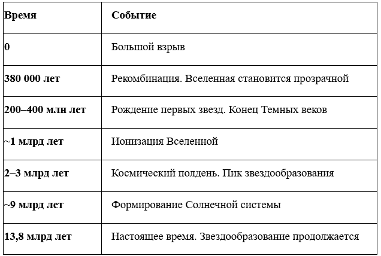
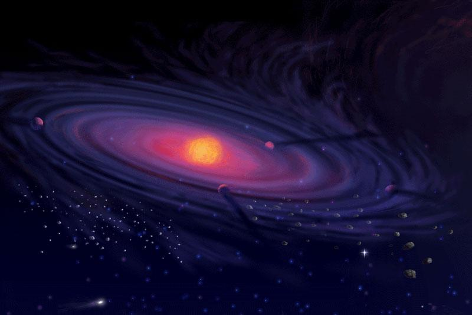
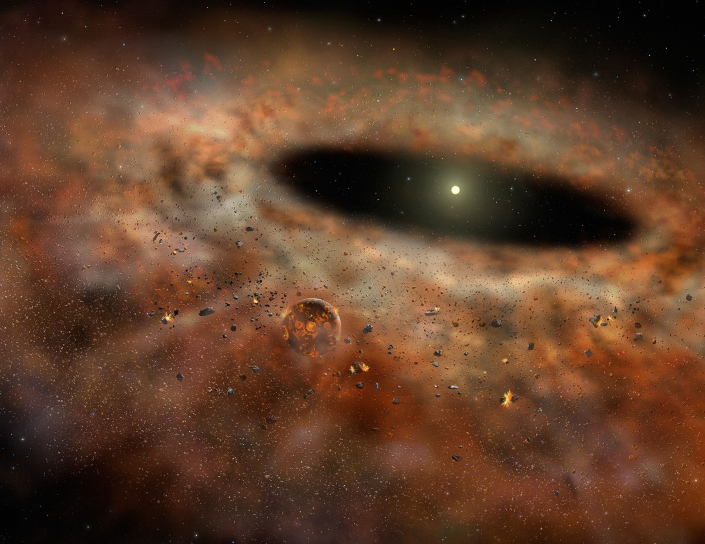
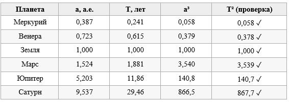
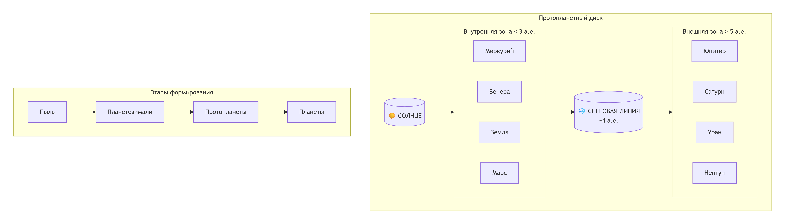

---
## Author
author:
  - name: Тойчубекова Асель Нурлановна
    degrees: DSc
    orcid: 0000-0002-0877-7063
    email: kulyabov-ds@rudn.ru
    affiliation:
      - name: Российский университет дружбы народов
        country: Российская Федерация
        postal-code: 117198
        city: Москва
        address: ул. Миклухо-Маклая, д. 6
  - name: Четвергова Мария Викторовна
    degrees: PhD
    orcid: 0000-0000-0000-0000
    email: email@rudn.ru
    affiliation:
      - name: Российский университет дружбы народов
        country: Российская Федерация
        postal-code: 117198
        city: Москва
        address: ул. Миклухо-Маклая, д. 6
  - name: Просина Ксения Максимовна 
    degrees: PhD
    orcid: 0000-0000-0000-0000
    email: email@rudn.ru
    affiliation:
      - name: Российский университет дружбы народов
        country: Российская Федерация
        postal-code: 117198
        city: Москва
        address: ул. Миклухо-Маклая, д. 6
  - name: Чигладзе Майя Владиславовна
    degrees: PhD
    orcid: 0000-0000-0000-0000
    email: email@rudn.ru
    affiliation:
      - name: Российский университет дружбы народов
        country: Российская Федерация
        postal-code: 117198
        city: Москва
        address: ул. Миклухо-Маклая, д. 6
  - name: Митрофанов Тимур Александрович
    degrees: PhD
    orcid: 0000-0000-0000-0000
    email: email@rudn.ru
    affiliation:
      - name: Российский университет дружбы народов
        country: Российская Федерация
        postal-code: 117198
        city: Москва
        address: ул. Миклухо-Маклая, д. 6## Title
title: Проект. Этап1
subtitle: Образование планетной системы.
license: CC BY
date: today
date-format: "YYYY-MM-DD" # Example: 2025-09-06
---

# Информация

## Докладчик

:::::::::::::: {.columns align=center}
::: {.column width="70%"}

  * Тойчубекова Асель Нурлановна
  * Студент 3 курс 
  * факультет физико математических и естественных наун
  * Российский университет дружбы народов им. П. Лумумбы
  * [1032235033@rudn.ru](1032235033@rudn.ru)

:::
::: {.column width="30%"}

:::
::::::::::::::

## Докладчик

:::::::::::::: {.columns align=center}
::: {.column width="70%"}

  * Четвергова Мария Викторовна
  * Студент 3 курс 
  * факультет физико математических и естественных наун
  * Российский университет дружбы народов им. П. Лумумбы
  * [1132232886@rudn.ru](1132232886@rudn.ru)

:::
::: {.column width="30%"}

:::
::::::::::::::

## Докладчик

:::::::::::::: {.columns align=center}
::: {.column width="70%"}

  * Просина Ксения Максимовна
  * Студент 3 курс 
  * факультет физико математических и естественных наун
  * Российский университет дружбы народов им. П. Лумумбы
  * [1132231938@rudn.ru](1132231938@rudn.ru)

:::
::: {.column width="30%"}

:::
::::::::::::::

## Докладчик

:::::::::::::: {.columns align=center}
::: {.column width="70%"}

  * Чигладзее Майя Владиславовна
  * Студент 3 курс 
  * факультет физико математических и естественных наун
  * Российский университет дружбы народов им. П. Лумумбы
  * [1132239399@rudn.ru](1132239399@rudn.ru)

:::
::: {.column width="30%"}

:::
::::::::::::::

## Докладчик

:::::::::::::: {.columns align=center}
::: {.column width="70%"}

  * Митрофанов Тимур Александрович
  * Студент 3 курс 
  * факультет физико математических и естественных наун
  * Российский университет дружбы народов им. П. Лумумбы
  * [1132231842@rudn.ru](1132231842@rudn.ru)

:::
::: {.column width="30%"}

:::
::::::::::::::

#  Описать происхождение звезд и звездных систем 

## От Большого взрыва к звездам

{width=70%}

## От Большого взрыва к звездам

{width=70%}

## Как рождается звезда (3 стадии)

Протозвезда: Гравитационный коллапс облака, формирование плотного ядра.

Молодая звезда: Вокруг формируется аккреционный диск, начинаются термоядерные реакции.

Выход на главную последовательность: Давление излучения уравновешивает гравитацию.

Результат: Рождение звезды и остаточный газопылевой диск.

#  Описать образование Солнечной системы

## Наша Солнечная система. Роль вращения

4,6 млрд лет назад: Сжатие "солнечной туманности".

Закон сохранения момента импульса:

При сжатии скорость вращения резко возрастает.

Облако сплющивается в протопланетный диск.

Парадокс момента импульса:

Солнце содержит 99% массы, но планеты несут 99% момента импульса системы.

{width=60%}

## Рождение планет  

Процесс формирования планет:

1. Пылевые частицы слипаются  
2. Образуются камни  
3. Возникают планетезимали  
4. Формируются протопланеты  
5. Появляются планет

{width=60%}

#  Третий закон Кеплера

## Третий закон Кеплера

Третий закон Кеплера — один из трёх законов о движении планет.

- Квадраты периодов относятся как кубы полуосей: T²/a³ = const
- В единицах СИ: T² = (4π²/GM) · a³
- Следствие: орбитальная скорость v = √(GM/r) ~ r^(−1/2)
- Чем дальше планета — тем она движется медленнее

{width=70%}

## Схема протопланетного диска

- Внутри снеговой линии — каменистые планеты
- За снеговой линией — газовые и ледяные гиганты
- Этапы: пыль → планетезимали → протопланеты → планеты

{width=70%}

#  Описание модели образования планетной системы

## Начальные условия. Распределение частиц

**Геометрия:** Круг радиуса $R_0$ (внешняя граница диска).

**Радиальное распределение:** Равномерное по площади.

Функция распределения:
$$ P(r) \sim r $$

Метод обратного преобразования:
$$ r = R_0 \cdot \sqrt{\xi_1}, \quad \xi_1 \in (0, 1] $$

**Угловое распределение:** Равномерное по азимуту.
$$ \alpha = 2\pi \cdot \xi_2, \quad \xi_2 \in (0, 1] $$

**Массы частиц:** Могут быть одинаковыми или распределенными по степенному закону.

##  Начальные условия. Кеплеровское вращение

**Угловая скорость на расстоянии $r$:**
$$ \omega(r) = \omega_0 \left( \frac{R_0}{r} \right)^{3/2} $$
где $\omega_0$ — угловая скорость на внешней границе диска.

**Компоненты скорости в декартовых координатах:**
$$ v_x = -\omega(r) \cdot y = -y \cdot \omega_0 \left( \frac{R_0}{r} \right)^{3/2} $$
$$ v_y = \omega(r) \cdot x = x \cdot \omega_0 \left( \frac{R_0}{r} \right)^{3/2} $$
$$ v_z = 0 $$

**Обоснование:** Это обеспечивает движение по круговым орбитам с центростремительным ускорением, равным гравитационному.

##  Полная сила взаимодействия

**Второй закон Ньютона для $i$-й частицы:**
$$ m_i \frac{d^2 \mathbf{r}_i}{dt^2} = \mathbf{F}_i $$

**Полная сила — сумма парных взаимодействий:**
$$ \mathbf{F}_i = \sum_{j \neq i} \left( \mathbf{F}_{ij}^{\text{grav}} + \mathbf{F}_{ij}^{\text{rep}} + \mathbf{F}_{ij}^{\text{fric}} \right) $$

**Три компоненты:**
1. **Гравитация** — дальнодействующее притяжение.
2. **Отталкивание** — короткодействующее, при контакте.
3. **Трение** — диссипация энергии при касательном движении.

## Модель 1: Гравитационное взаимодействие

**Потенциал Ньютона:**
$$ U_{ij}^{\text{grav}} = -\frac{\gamma m_i m_j}{r_{ij}} $$
где $r_{ij} = |\mathbf{r}_i - \mathbf{r}_j|$ — расстояние между центрами частиц, $\gamma$ — гравитационная постоянная.

**Сила, действующая на частицу $i$ со стороны $j$:**
$$ \mathbf{F}_{ij}^{\text{grav}} = -\nabla U_{ij}^{\text{grav}} = \frac{\gamma m_i m_j}{r_{ij}^3} (\mathbf{r}_j - \mathbf{r}_i) $$

**Особенность:** Дальнодействие — требует учета всех пар частиц ($O(N^2)$ сложность).

## Модель 2: Отталкивание при контакте

**Условие контакта:** $b = r_{ij} < a = R_i + R_j$

**Потенциал отталкивания (степенной):**
$$ U_{ij}^{\text{rep}}(b) = \frac{k a^8}{7 b^7} - k b $$

**Сила отталкивания:**
$$ \mathbf{F}_{ij}^{\text{rep}} = k \left[ \left( \frac{a}{b} \right)^8 - 1 \right] \frac{\mathbf{r}_{ij}}{b}, \quad b < a $$

**Параметры:**
- $k$ — коэффициент жесткости (определяет упругость).
- Показатель степени 8 обеспечивает быстрое нарастание силы при сближении (крутой потенциал).

**Назначение:** Предотвращает нефизическое проникновение частиц.

## Модель 3: Трение и диссипация

**Необходимость:** Моделирует потерю энергии, необходимую для слипания.

**Относительная тангенциальная скорость:**
$$ W_{\perp} = \mathbf{W} \cdot \mathbf{n} - \omega_i R_i - \omega_j R_j $$
где $\mathbf{W} = \mathbf{v}_i - \mathbf{v}_j$ — относительная скорость, $\mathbf{n}$ — единичный вектор касательной, $\omega$ — угловые скорости вращения частиц.

**Сила трения (вязкая модель):**
$$ \mathbf{F}_{ij}^{\text{fric}} = \beta \, W_{\perp} \, F^{\text{rep}}(b) \cdot \mathbf{n} $$
где $\beta$ — коэффициент вязкого трения.

**Физический смысл:** Сила пропорциональна нормальной силе (закон Амонтона-Кулона) и относительной скорости (вязкость).

## Модель вращения частиц (спин)

Каждая частица — твердый шар с моментом инерции:
$$ I_i = \frac{2}{5} m_i R_i^2 $$

**Момент силы от трения:**
$$ \mathbf{M}_{ij} = \mathbf{r}_{ij} \times \mathbf{F}_{ij}^{\text{fric}} \cdot \frac{R_i}{R_i + R_j} $$
(Момент распределяется пропорционально радиусам)

**Уравнение вращательного движения:**
$$ I_i \frac{d \boldsymbol{\omega}_i}{dt} = \sum_{j} \mathbf{M}_{ij} $$

**Важность:** Вращение влияет на динамику столкновений и перераспределение момента импульса.

## Процесс аккреции (слипания)

**Критерий:** $r_{ij} < R_i + R_j$ **И** относительная скорость ниже порога.

**Законы сохранения при слиянии:**

1. **Масса:**
   $$ m = m_i + m_j $$

2. **Радиус** (сохранение объема):
   $$ R = \sqrt[3]{R_i^3 + R_j^3} $$

3. **Положение** (центр масс):
   $$ \mathbf{r} = \frac{m_i \mathbf{r}_i + m_j \mathbf{r}_j}{m_i + m_j} $$

4. **Скорость** (центр масс):
   $$ \mathbf{v} = \frac{m_i \mathbf{v}_i + m_j \mathbf{v}_j}{m_i + m_j} $$

5. **Угловая скорость:** Из сохранения полного момента импульса относительно нового центра масс.

## Слайд: Численный метод и оптимизация вычислений

**Интегрирование уравнений движения:**
- Используется **алгоритм Верле (Verlet)** или его скоростная модификация.
- Преимущества:
  - Хорошая стабильность.
  - Сохранение энергии в консервативных системах.
  - Достаточная точность для диссипативных процессов.

**Оптимизация гравитационных расчетов:**
- Прямое вычисление сил требует $O(N^2)$ операций — непрактично при больших $N$.
- Применяются методы ускорения:

| Метод | Сложность |
|-------|-----------|
| **Particle-Mesh (PM)** | $O(N \log N)$ |
| **Мультипольное разложение (FMM)** | $O(N \log N)$ |

**Результат:** Снижение вычислительной сложности позволяет моделировать системы с большим числом частиц.

## Численный метод и оптимизация

- **Интегрирование:** Алгоритм Верле (Verlet) — стабильность, сохранение энергии.
- **Проблема:** Прямое вычисление гравитации — $O(N^2)$ операций.
- **Решение:** 
  - **Particle-Mesh (PM)** — $O(N \log N)$
  - **Мультипольное разложение (FMM)** — $O(N \log N)$
- **Итог:** Ускорение расчетов позволяет моделировать большие системы частиц.

## Заключение

На текущем этапе выполнен обзор современных представлений о формировании звезд и планетных систем. Рассмотрены ключевые этапы эволюции протопланетного диска (гравитационная неустойчивость, сохранение момента импульса, кеплерово вращение).

Предложена математическая модель динамики частиц, учитывающая гравитационное взаимодействие, упругое отталкивание, трение и аккрецию. Для численной реализации выбраны алгоритм Верле и методы ускорения вычислений (Particle-Mesh или Fast Multipole Method).

Сформирована теоретическая основа и модель для последующей программной реализации.

## Список литературы

- Медведев Д. А. и др. Моделирование физических процессов и явлений на ПК. — Новосибирск: НГУ, 2010. — 101 с.
- Сурдин В. Г. Рождение звезд. — М.: Едиториал УРСС, 2001.
- Лифшиц Е. М., Питаевский Л. П. Теоретическая физика. Т. 1: Механика. — М.: Наука, 2004.
- Armitage P. J. Astrophysics of Planet Formation. — Cambridge University Press, 2010.
- Сурдин В. Г. Рождение звезд. — М.: Едиториал УРСС, 2001.
- Томилин А. Н. Занимательная космогония. — М.: Проспект, 2022.
- Бааде В. Эволюция звезд и галактик. — М.: УРСС, 2002.
- Фридман А.А., Леметр Ж., Гамов Г.А. Теория расширяющейся Вселенной и Большого взрыва. — Классические работы, заложившие основы современной космологии.
