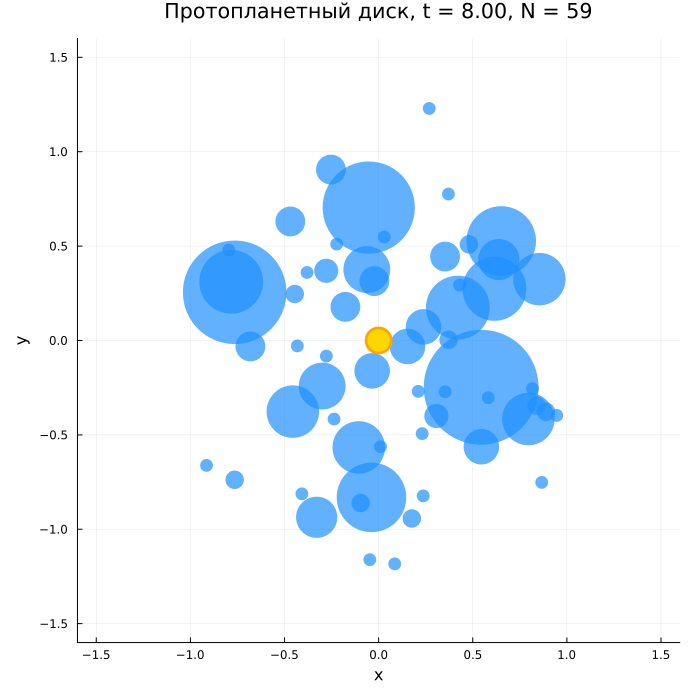
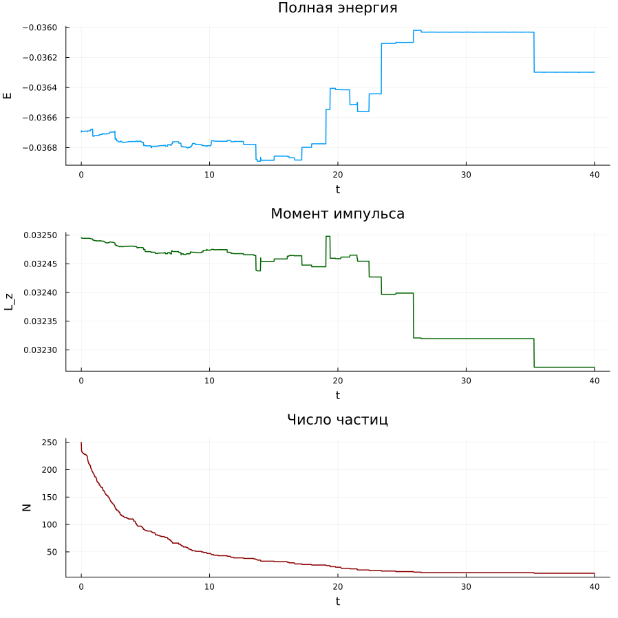

---
## Author
author:
  - name: Тойчубекова Асель Нурлановна
    degrees: DSc
    orcid: 0000-0002-0877-7063
    email: kulyabov-ds@rudn.ru
    affiliation:
      - name: Российский университет дружбы народов
        country: Российская Федерация
        postal-code: 117198
        city: Москва
        address: ул. Миклухо-Маклая, д. 6
  - name: Четвергова Мария Викторовна
    degrees: PhD
    orcid: 0000-0000-0000-0000
    email: email@rudn.ru
    affiliation:
      - name: Российский университет дружбы народов
        country: Российская Федерация
        postal-code: 117198
        city: Москва
        address: ул. Миклухо-Маклая, д. 6
  - name: Просина Ксения Максимовна 
    degrees: PhD
    orcid: 0000-0000-0000-0000
    email: email@rudn.ru
    affiliation:
      - name: Российский университет дружбы народов
        country: Российская Федерация
        postal-code: 117198
        city: Москва
        address: ул. Миклухо-Маклая, д. 6
  - name: Чигладзе Майя Владиславовна
    degrees: PhD
    orcid: 0000-0000-0000-0000
    email: email@rudn.ru
    affiliation:
      - name: Российский университет дружбы народов
        country: Российская Федерация
        postal-code: 117198
        city: Москва
        address: ул. Миклухо-Маклая, д. 6
  - name: Митрофанов Тимур Александрович
    degrees: PhD
    orcid: 0000-0000-0000-0000
    email: email@rudn.ru
    affiliation:
      - name: Российский университет дружбы народов
        country: Российская Федерация
        postal-code: 117198
        city: Москва
        address: ул. Миклухо-Маклая, д. 6
title: Проект. Этап 2
subtitle: Алгоритмы решения задачи. Образование планетной системы
license: CC BY
date: today
date-format: "YYYY-MM-DD"
---

# Информация

## Докладчик

:::::::::::::: {.columns align=center}
::: {.column width="70%"}

  * Тойчубекова Асель Нурлановна
  * Студент 3 курс 
  * факультет физико математических и естественных наун
  * Российский университет дружбы народов им. П. Лумумбы
  * [1032235033@rudn.ru](1032235033@rudn.ru)

:::
::: {.column width="30%"}

:::
::::::::::::::

## Докладчик

:::::::::::::: {.columns align=center}
::: {.column width="70%"}

  * Четвергова Мария Викторовна
  * Студент 3 курс 
  * факультет физико математических и естественных наун
  * Российский университет дружбы народов им. П. Лумумбы
  * [1132232886@rudn.ru](1132232886@rudn.ru)

:::
::: {.column width="30%"}

:::
::::::::::::::

## Докладчик

:::::::::::::: {.columns align=center}
::: {.column width="70%"}

  * Просина Ксения Максимовна
  * Студент 3 курс 
  * факультет физико математических и естественных наун
  * Российский университет дружбы народов им. П. Лумумбы
  * [1132231938@rudn.ru](1132231938@rudn.ru)

:::
::: {.column width="30%"}

:::
::::::::::::::

## Докладчик

:::::::::::::: {.columns align=center}
::: {.column width="70%"}

  * Чигладзее Майя Владиславовна
  * Студент 3 курс 
  * факультет физико математических и естественных наун
  * Российский университет дружбы народов им. П. Лумумбы
  * [1132239399@rudn.ru](1132239399@rudn.ru)

:::
::: {.column width="30%"}

:::
::::::::::::::

## Докладчик

:::::::::::::: {.columns align=center}
::: {.column width="70%"}

  * Митрофанов Тимур Александрович
  * Студент 3 курс 
  * факультет физико математических и естественных наун
  * Российский университет дружбы народов им. П. Лумумбы
  * [1132231842@rudn.ru](1132231842@rudn.ru)

:::
::: {.column width="30%"}

:::
::::::::::::::

# Назначение работы

## Назначение работы

Цель третьего этапа — программная реализация алгоритма, разработанного на втором этапе, в виде работающего расчётного кода и получение визуальных результатов моделирования эволюции протопланетного диска.

В качестве языка реализации выбран **Julia 1.10** — современный высокопроизводительный язык для научных вычислений, производительность сопоставима с C/Fortran. Используется инфраструктура **DrWatson.jl**: автоматически создаёт стандартизованные каталоги, облегчает воспроизводимость расчётов.

## Что реализовано

* Инициализация $N$ частиц равномерно по диску радиуса $R_0$ с кеплеровскими начальными скоростями
* Гравитационное взаимодействие $O(N^2)$ между всеми парами частиц со сглаживанием (softening)
* Упругое отталкивание при контакте и диссипативное трение, отбирающее тангенциальную энергию
* Скоростной алгоритм Верле для интегрирования уравнений движения
* Аккреция (слияние) частиц при контакте и низкой относительной скорости
* Контроль сохраняющихся величин — полной энергии $E(t)$ и момента импульса $L_z(t)$
* Сохранение PNG-снимков состояния системы и графиков диагностических кривых

# Состав программного комплекса

## Состав программного комплекса

Программный комплекс поставляется в виде единственного файла **`protoplanetary_disk.jl`** (≈ 14 800 байт, 300+ строк). Файл полностью самодостаточен: все параметры, структуры данных, алгоритмы и процедуры вывода результатов сосредоточены в одном месте, что облегчает понимание, проверку и воспроизведение расчёта.

Структура проекта (DrWatson):

| Путь | Назначение |
|---|---|
| `Project.toml`, `Manifest.toml` | Описание окружения Julia |
| `scripts/protoplanetary_disk.jl` | Основной расчётный код |
| `plots/protoplanetary_disk/` | Каталог PNG-результатов (создаётся автоматически) |
| `data/` | Каталог для числовых данных (резерв для расширений) |

# Описание программной реализации

## Язык программирования и зависимости

Язык **Julia 1.10** выбран по следующим соображениям: производительность, сопоставимая с C/Fortran, при высокоуровневом синтаксисе; встроенная поддержка линейной алгебры и числовых методов; богатая экосистема пакетов для научных вычислений.

Внешние зависимости:

* **`DrWatson.jl`** — управление проектом, стандартизованные пути к данным и графикам
* **`Plots.jl`** — построение scatter-диаграмм и сохранение в PNG
* **`Random.jl`** — генератор Mersenne Twister, воспроизводимость через `SEED = 42`
* **`LinearAlgebra.jl`** — векторные операции, норма, скалярное произведение

## Структуры данных

Центральный объект модели — изменяемая структура `Particle`: координаты $(x, y)$, скорости $(v_x, v_y)$, ускорения $(a_x, a_y)$, масса $m$, радиус $r$, флаг `alive`. Поглощённые частицы помечаются `alive = false` — без удаления из памяти, что исключает динамическое перераспределение памяти в ходе счёта.

Радиус вычисляется из массы при постоянной плотности $\rho$:

$$r = \left(\frac{3m}{4\pi\rho}\right)^{1/3}$$

где $m$ — масса частицы, $\rho = 30.0$ — плотность вещества. При слиянии двух тел объёмы складываются: $r_\text{new}^3 = r_i^3 + r_j^3$.

## Основные функции и модули

| **Компонент алгоритма** | **Реализация в коде** |
|---|---|
| Инициализация диска | `init_disk()` — равномерное распределение, кеплеровские скорости |
| Расчёт ускорений | `compute_accelerations!()` — гравитация звезды + попарная + отталкивание + трение |
| Интегрирование | `verlet_step!()` — скоростной алгоритм Верле |
| Аккреция | `process_mergers!()` — слияние при контакте и $v_\text{rel} < V_\text{MERGE}$ |
| Диагностика | `total_energy()`, `total_angular_momentum()` |
| Визуализация | `plot_snapshot()`, `savefig()` |

## `init_disk()` — инициализация

Равномерное распределение по площади через полярные координаты:

$$r = R_0\sqrt{\xi_1}, \quad \varphi = 2\pi\xi_2, \qquad \xi_1, \xi_2 \sim \mathrm{Uniform}[0,1]$$

Квадратный корень обеспечивает постоянную поверхностную плотность — без него частицы концентрировались бы в центре. Начальные скорости — кеплеровские круговые орбиты: $v_\text{circ} = \sqrt{G M_\star / r}$, направление перпендикулярно радиус-вектору.

## `compute_accelerations!()` — расчёт ускорений

Ускорение каждой частицы складывается из трёх вкладов.

**Гравитация центральной звезды** и **попарная гравитация** частиц — с одним и тем же сглаживанием $\varepsilon = 0.05$:

$$\vec{a}_i = -\frac{G M_\star \,\vec{r}_i}{(r_i^2 + \varepsilon^2)^{3/2}} + \sum_{j \ne i} \frac{G m_j \,(\vec{r}_j - \vec{r}_i)}{(|\vec{r}_j - \vec{r}_i|^2 + \varepsilon^2)^{3/2}}$$

Сглаживание $\varepsilon$ устраняет численную особенность при $r \to 0$. Каждая пара $(i,j)$ обрабатывается один раз — ускорения прибавляются обоим с противоположными знаками (третий закон Ньютона).

**Упругое отталкивание и трение** при контакте $r < r_i + r_j$:

$$F_\text{rep} = K_\text{REP} \cdot \left[\left(\tfrac{r_i+r_j}{r}\right)^8 - 1\right], \qquad \vec{F}_\text{fric} = -\beta_\text{fric} \cdot F_\text{rep} \cdot \vec{v}_\text{tg}$$

$F_\text{rep}$ обращается в ноль при касании и резко растёт при перекрытии. $\vec{F}_\text{fric}$ убирает тангенциальную составляющую относительной скорости — делает столкновение неупругим, что запускает аккрецию.

## `verlet_step!()` — интегрирование

Скоростной алгоритм Верле — три последовательных шага:

$$\vec{r}(t+\Delta t) = \vec{r}(t) + \vec{v}(t)\,\Delta t + \tfrac{1}{2}\,\vec{a}(t)\,\Delta t^2$$

$$\vec{a}(t+\Delta t) = \vec{F}\bigl(\vec{r}(t+\Delta t)\bigr) / m \quad \text{(пересчёт сил в новых позициях)}$$

$$\vec{v}(t+\Delta t) = \vec{v}(t) + \tfrac{1}{2}\bigl[\vec{a}(t) + \vec{a}(t+\Delta t)\bigr]\Delta t$$

Метод обладает **вторым порядком точности** и **симплектической структурой** — фазовый объём сохраняется, ошибки не накапливаются. При $\Delta t = 0.002$ относительная погрешность $E$ и $L_z$ составляет $10^{-3}$–$10^{-4}$.

## `process_mergers!()` — аккреция

Два условия слияния для пары $(i, j)$: контакт $r < r_i + r_j$ **и** малая скорость $|\vec{v}_i - \vec{v}_j| < V_\text{MERGE}$.

При выполнении обоих тело $i$ поглощает $j$ по закону сохранения импульса:

$$\vec{r}_\text{new} = \frac{m_i \vec{r}_i + m_j \vec{r}_j}{m_i + m_j}, \quad \vec{v}_\text{new} = \frac{m_i \vec{v}_i + m_j \vec{v}_j}{m_i + m_j}, \quad m_\text{new} = m_i + m_j$$

Частица $j$ деактивируется (`alive = false`). Порог $V_\text{MERGE}$ предотвращает слияние при высокоскоростных столкновениях.

# Параметры моделирования

## Параметры базового расчёта

| **Параметр** | **Значение** | **Описание** |
|---|---|---|
| `N0` | 250 | Начальное число частиц |
| `M_TOTAL` | 0.04 | Суммарная масса диска (в долях $M_\star$) |
| `DENSITY` | 30.0 | Плотность вещества — определяет радиус частиц |
| `EPS_SOFT` | 0.05 | Параметр сглаживания гравитации |
| `K_REP` | 4.0 | Жёсткость упругого отталкивания |
| `BETA_FRIC` | 0.20 | Коэффициент диссипативного трения |
| `V_MERGE` | 1.2 | Порог относительной скорости для слияния |
| `DT` | 0.002 | Шаг по времени |
| `T_MAX` | 40.0 | Полное время моделирования |
| `SNAPSHOTS` | 6 | Число сохраняемых снимков |
| `SEED` | 42 | Начальное число (воспроизводимость) |

## Параметры базового расчёта

Счётная сложность основного цикла: $O(N^2 \cdot T_\text{MAX}/\Delta t)$. При базовых параметрах — порядка $1.25 \times 10^9$ пар-шагов. Поскольку $N$ убывает за счёт аккреции, реальное время счёта составляет **несколько минут** на обычном ноутбуке.

# Результаты расчёта

## Эволюция протопланетного диска

Размер маркера пропорционален массе частицы. Жёлтая точка в центре — центральная звезда $M_\star = 1$.

:::::::::::::: {.columns align=top}
::: {.column width="50%"}

{width=60%}

:::
::: {.column width="50%"}

{width=60%}

:::
::::::::::::::

## Эволюция протопланетного диска (продолжение)

:::::::::::::: {.columns align=top}
::: {.column width="50%"}

{width=60%}

:::
::: {.column width="50%"}

{width=60%}

:::
::::::::::::::

## Эволюция протопланетного диска (окончание)

:::::::::::::: {.columns align=top}
::: {.column width="50%"}

{width=60%}

:::
::: {.column width="50%"}

{width=60%}

:::
::::::::::::::

## Сохраняющиеся величины

:::::::::::::: {.columns align=top}
::: {.column width="40%"}

{width=90%}

:::
::: {.column width="60%"}

**Полная механическая энергия $E(t)$** убывает монотонно из-за диссипативного трения и неупругих слияний. Относительные колебания $\sim 10^{-3}$–$10^{-4}$ — численной неустойчивости нет. Точность сохранения лучше 1% — типичный результат для алгоритма Верле.

**Момент импульса $L_z(t)$** сохраняется значительно лучше энергии — отклонения $\approx 10^{-4}$. Все внутренние силы центральные, поэтому $L_z$ нарушается лишь за счёт ошибок округления `Float64`.

**Число частиц $N(t)$** убывает ступенчато. Основная масса аккреции — при $t < 10$, когда диск плотный. После $t \approx 15$–$20$ крупные тела разнесены по орбитам и перестают сближаться — $N$ стабилизируется около 11–12.

:::
::::::::::::::

# Интерпретация результатов

## Интерпретация результатов

Расчёт воспроизводит ключевые качественные черты реального сценария формирования планетной системы:

* **Иерархическое укрупнение:** из равномерного облака 250 мелких частиц быстро формируется небольшое число (~10–20) массивных тел-протопланет. Крупные тела имеют бо́льшее гравитационное сечение захвата — процесс самоускоряется.

* **Степенной закон убывания числа тел:** большинство аккреции происходит на ранних временах, когда плотность диска высока. После разрежения темп резко падает.

* **Стабилизация орбит:** крупные тела занимают характерные орбиты и практически не взаимодействуют в конце расчёта.

* **Численная устойчивость:** сохранение $E$ и $L_z$ на уровне $10^{-3}$–$10^{-4}$ подтверждает правильность выбора шага $\Delta t$ и параметра сглаживания $\varepsilon$.

Качественная картина соответствует сценарию **пыль → планетезимали → протопланеты**, описанному в первом этапе проекта.

## Заключение

В рамках третьего этапа реализован численный код моделирования протопланетного диска на языке Julia. Все ключевые элементы алгоритма из второго этапа — кеплеровская инициализация, гравитация со сглаживанием, упругое отталкивание, диссипативное трение, аккреция и скоростной алгоритм Верле — представлены в коде в виде отдельных функций с чёткими интерфейсами.

Воспроизводимый расчёт (`SEED = 42`) даёт качественно правильную картину формирования планетной системы из равномерного диска и подтверждает корректность алгоритма по контрольным сохраняющимся величинам.
