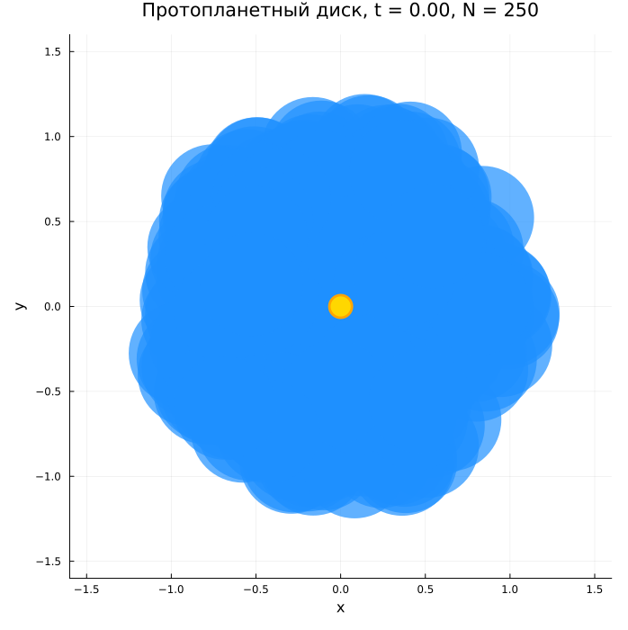
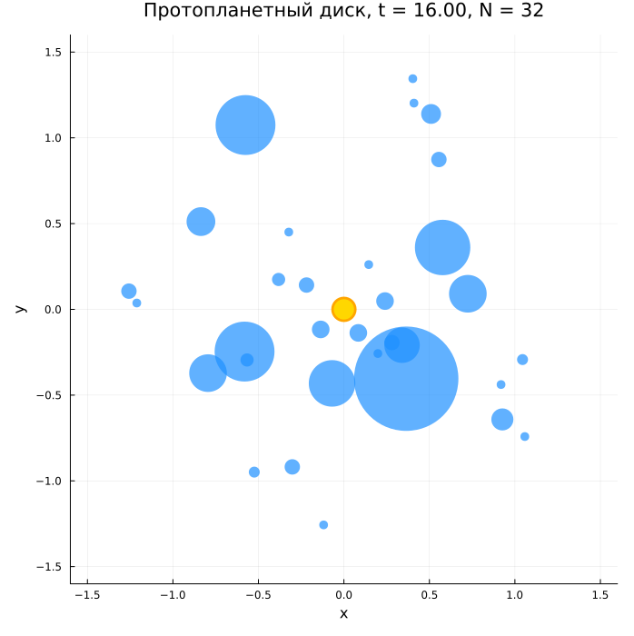
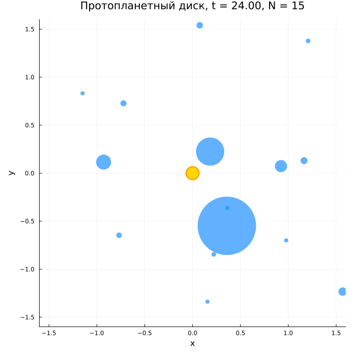
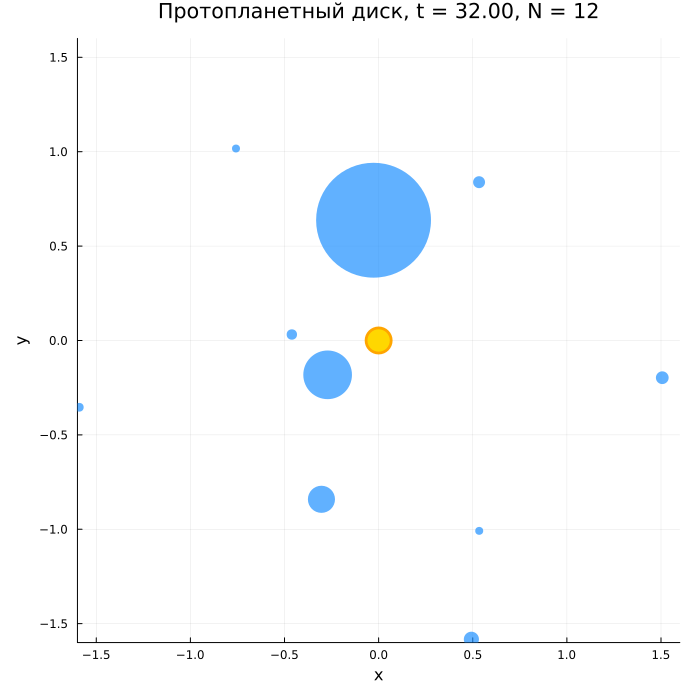
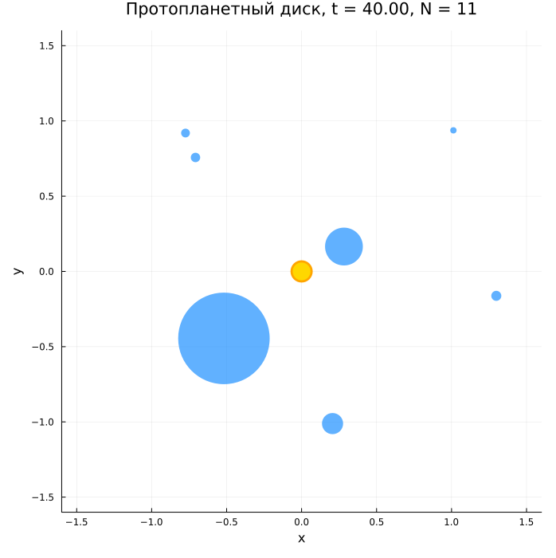
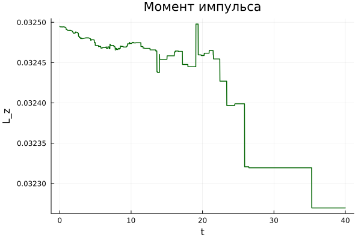
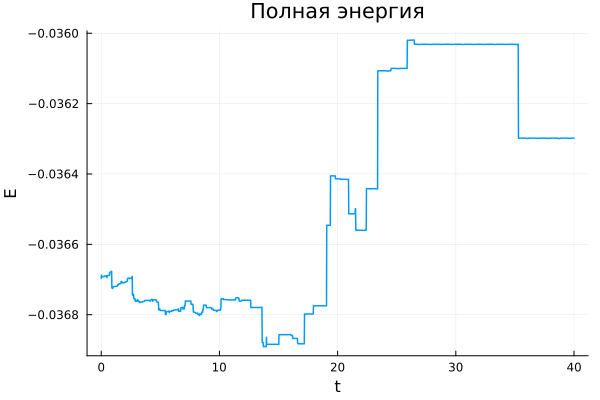
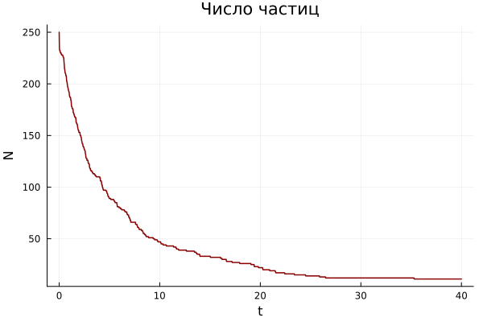

---
## Author
author:
  - name: Тойчубекова Асель Нурлановна
    degrees: DSc
    orcid: 0000-0002-0877-7063
    email: kulyabov-ds@rudn.ru
    affiliation:
      - name: Российский университет дружбы народов
        country: Российская Федерация
        postal-code: 117198
        city: Москва
        address: ул. Миклухо-Маклая, д. 6
  - name: Четвергова Мария Викторовна
    degrees: PhD
    orcid: 0000-0000-0000-0000
    email: email@rudn.ru
    affiliation:
      - name: Российский университет дружбы народов
        country: Российская Федерация
        postal-code: 117198
        city: Москва
        address: ул. Миклухо-Маклая, д. 6
  - name: Просина Ксения Максимовна 
    degrees: PhD
    orcid: 0000-0000-0000-0000
    email: email@rudn.ru
    affiliation:
      - name: Российский университет дружбы народов
        country: Российская Федерация
        postal-code: 117198
        city: Москва
        address: ул. Миклухо-Маклая, д. 6
  - name: Чигладзе Майя Владиславовна
    degrees: PhD
    orcid: 0000-0000-0000-0000
    email: email@rudn.ru
    affiliation:
      - name: Российский университет дружбы народов
        country: Российская Федерация
        postal-code: 117198
        city: Москва
        address: ул. Миклухо-Маклая, д. 6
  - name: Митрофанов Тимур Александрович
    degrees: PhD
    orcid: 0000-0000-0000-0000
    email: email@rudn.ru
    affiliation:
      - name: Российский университет дружбы народов
        country: Российская Федерация
        postal-code: 117198
        city: Москва
        address: ул. Миклухо-Маклая, д. 6
title: Проект. Этап 4
subtitle: Защита проекта. Образование планетной системы
license: CC BY
date: today
date-format: "YYYY-MM-DD"
---

# Информация

## Докладчик

:::::::::::::: {.columns align=center}
::: {.column width="70%"}

  * Тойчубекова Асель Нурлановна
  * Студент 3 курса 
  * факультет физико-математических и естественных наук
  * Российский университет дружбы народов им. П. Лумумбы
  * [1032235033@rudn.ru](1032235033@rudn.ru)

:::
::: {.column width="30%"}

:::
::::::::::::::

## Докладчик

:::::::::::::: {.columns align=center}
::: {.column width="70%"}

  * Четвергова Мария Викторовна
  * Студент 3 курса 
  * факультет физико-математических и естественных наук
  * Российский университет дружбы народов им. П. Лумумбы
  * [1132232886@rudn.ru](1132232886@rudn.ru)

:::
::: {.column width="30%"}

:::
::::::::::::::

## Докладчик

:::::::::::::: {.columns align=center}
::: {.column width="70%"}

  * Просина Ксения Максимовна
  * Студент 3 курса 
  * факультет физико-математических и естественных наук
  * Российский университет дружбы народов им. П. Лумумбы
  * [1132231938@rudn.ru](1132231938@rudn.ru)

:::
::: {.column width="30%"}

:::
::::::::::::::

## Докладчик

:::::::::::::: {.columns align=center}
::: {.column width="70%"}

  * Чигладзе Майя Владиславовна
  * Студент 3 курса 
  * факультет физико-математических и естественных наук
  * Российский университет дружбы народов им. П. Лумумбы
  * [1132239399@rudn.ru](1132239399@rudn.ru)

:::
::: {.column width="30%"}

:::
::::::::::::::

## Докладчик

:::::::::::::: {.columns align=center}
::: {.column width="70%"}

  * Митрофанов Тимур Александрович
  * Студент 3 курса 
  * факультет физико-математических и естественных наук
  * Российский университет дружбы народов им. П. Лумумбы
  * [1132231842@rudn.ru](1132231842@rudn.ru)

:::
::: {.column width="30%"}

:::
::::::::::::::

# Введение

## Научная проблема

Ключевой вопрос: как из диффузного газопылевого облака, вращающегося вокруг молодой звезды, формируется упорядоченная система планет?

Актуальность:

* Солнечная система сформировалась $\approx 4{,}6$ млрд лет назад из солнечной туманности
* Аналитические решения для $N \gg 2$ тел не существуют (проблема $N$ тел)
* Прямые наблюдения ранней Солнечной системы невозможны

Инструмент исследования: численное моделирование — от первых расчётов Аарсета (1960-е) до современных симуляций с $N \sim 10^6$ частиц.

## Цель четвёртого этапа

Представить полный обзор проделанной работы:

* Обзор всех этапов проекта (теория $\to$ алгоритмы $\to$ код)
* Анализ полученных результатов
* Честная оценка ограничений модели
* Направления развития
* Самооценка деятельности группы

# Полный обзор проекта

## Физическая модель (Этап 1)

Начальные условия — небулярная теория: диск газа и пыли вращается с кеплеровской скоростью $\omega(r) \propto r^{-3/2}$.

Три типа сил:

* **Гравитация:** $\mathbf{F}_{ij}^{\text{grav}} = \dfrac{\gamma m_i m_j}{r_{ij}^3}(\mathbf{r}_j - \mathbf{r}_i)$ — дальнодействующее притяжение
* **Отталкивание:** $\mathbf{F}_{ij}^{\text{rep}} = k\!\left[\left(\dfrac{a}{b}\right)^{\!8} - 1\right]\dfrac{\mathbf{r}_{ij}}{b}$ — предотвращает проникновение
* **Трение:** $\mathbf{F}_{ij}^{\text{fric}} = \beta\, W_{\perp}\, F^{\text{rep}}$ — диссипация энергии, запуск аккреции

Аккреция: слияние при контакте и малой относительной скорости.

## Алгоритмы (Этап 2)

Инициализация диска — равномерное распределение по площади:

$$r = R_0\sqrt{\xi_1}, \quad \alpha = 2\pi\xi_2, \quad \xi_1,\,\xi_2 \sim U[0,1]$$

Кеплеровские скорости:

$$v_x = -y\,\omega_0\left(\frac{R_0}{r}\right)^{3/2}, \qquad v_y = x\,\omega_0\left(\frac{R_0}{r}\right)^{3/2}$$

Интегрирование — скоростной алгоритм Верле (2-й порядок, симплектический).

Ускорение вычислений — рассмотрены PM ($O(N + M\log M)$) и FMM ($O(N\log N)$).

## Программная реализация (Этап 3)

Язык: Julia 1.10 — производительность C/Fortran + высокоуровневый синтаксис.

Инфраструктура: DrWatson.jl — воспроизводимость, стандартные каталоги.

Структура данных: `struct Particle` с полями $(x,\,y)$, $(v_x,\,v_y)$, $(a_x,\,a_y)$, $m$, $r$, `alive`.

Ключевые функции:

* `init_disk()` — инициализация частиц
* `compute_accelerations!()` — расчёт всех сил
* `verlet_step!()` — интегрирование Верле
* `process_mergers!()` — обработка слияний
* `total_energy()`, `total_angular_momentum()` — диагностика

## Параметры базового расчёта

| Параметр | Значение | Описание |
|---|---|---|
| $N_0$ | 250 | начальное число частиц |
| $M_{\text{total}}$ | 0.04 | масса диска (в $M_\star$) |
| $\varepsilon_{\text{soft}}$ | 0.05 | сглаживание гравитации |
| $K_{\text{rep}}$ | 4.0 | жёсткость отталкивания |
| $\beta_{\text{fric}}$ | 0.20 | коэффициент трения |
| $V_{\text{merge}}$ | 1.2 | порог скорости для слияния |
| $\Delta t$ | 0.002 | шаг по времени |
| $T_{\text{max}}$ | 40.0 | полное время моделирования |

# Анализ результатов

## Три стадии эволюции

1. **Быстрая аккреция** ($t = 0$–$10$)
   * Диск плотный, частицы часто сближаются
   * Число тел: $250 \to 59$ ($\approx 190$ слияний)
   * Система хаотична, тела разных размеров рассеяны по диску

2. **Формирование зародышей** ($t = 10$–$20$)
   * Темп аккреции замедляется
   * Формируется иерархия: 1–2 доминирующих тела + множество мелких

3. **Квазистабильность** ($t > 20$)
   * Число тел стабилизируется ($N \approx 11$–$15$)
   * Крупнейший объект аккумулировал основную часть массы
   * Система перешла в устойчивую конфигурацию

## Эволюция протопланетного диска

:::::::::::::: {.columns}
::: {.column width="20%"}

:::
::: {.column width="20%"}

:::
::: {.column width="20%"}

:::
::::::::::::::

## Сохраняющиеся величины

**Момент импульса** $L_z(t)$ — отклонения $\approx 10^{-4}$ (отлично)

**Полная энергия** $E(t)$ — монотонно убывает (диссипация), осцилляции $\sim 10^{-3}$–$10^{-4}$ (численной неустойчивости нет)

**Число частиц** $N(t)$ — быстрый спад в начале, насыщение после $t \approx 20$

## Сохраняющиеся величины

:::::::::::::: {.columns}
::: {.column width="20%"}

:::
::: {.column width="20%"}

:::
::::::::::::::

## Соответствие реальной физике

Модель качественно воспроизводит:

* **Иерархическое укрупнение** — «планетарный зародыш» набирает массу быстрее соседей
* **Снижение темпа аккреции** — переход к стадии «поздней тяжёлой бомбардировки»
* **Стабилизацию орбит** — несколько тел с разными массами на незаметно взаимодействующих орбитах

# Ограничения модели

## Ключевые упрощения

| Ограничение | Влияние на результат |
|---|---|
| $O(N^2)$ сложность | $N \lesssim 500$, каждая частица = макроскопический сгусток |
| 2D геометрия | Частота столкновений завышена (нет вертикальных колебаний) |
| Отсутствие газа | Газ $= 99\%$ массы диска, нет миграции планет и газовых гигантов |
| Линейное трение | Реальная диссипация зависит от состава и структуры поверхности |
| Одинаковые начальные массы | Занижен темп ранней аккреции |
| Сглаживание $\varepsilon = 0.05$ | Подавляет захват в резонанс и гравитационное рассеяние |

# Перспективы развития

## Технические улучшения

* **Методы ускорения** — FMM или PM ($O(N^2) \to O(N\log N)$, $N \sim 10^4$–$10^5$)
* **Переход в 3D** — добавление третьей координаты и вертикального распределения
* **Адаптивный шаг** — автоматическое уменьшение $\Delta t$ при тесных сближениях

## Физические расширения

* **Газовая компонента** — лобовое сопротивление, орбитальный дрейф
* **Степенной закон масс** — $n(m) \propto m^{-q}$ с $q \approx 3$–$4$
* **Зоны диска** — внутренняя каменистая, снеговая линия, внешняя зона летучих веществ

## Верификация и валидация

* Сравнение с аналитическими моделями коагуляции
* Воспроизведение задачи двух тел и рассеяния
* Сопоставление с каталогом экзопланет NASA

# Самооценка группы

## Вклад участников

| Участник | Вклад |
|---|---|
| Тойчубекова А.Н. | Научный обзор, координация, итоговое редактирование |
| Четвергова М.В. | Физическая модель, алгоритм инициализации |
| Просина К.М. | Диагностические функции, анализ сохраняющихся величин, оформление отчётов |
| Чигладзе М.В. | Алгоритм аккреции, тестирование и отладка кода |
| Митрофанов Т.А. | Программная реализация на Julia, визуализация |

## Что получилось хорошо

* **Логика проекта** — чёткая последовательность: теория $\to$ алгоритм $\to$ код
* **Физическая адекватность** — качественно правильная картина при упрощениях
* **Численная устойчивость** — сохранение $L_z$ на уровне $10^{-4}$
* **Воспроизводимость** — DrWatson + фиксированный `SEED = 42`

## Что стоило сделать иначе

* **Параметрическое исследование** — расчёт только при одном наборе параметров
* **Раннее прототипирование** — выявило бы проблемы с размерностью раньше
* **Документирование** — часть решений в коде без комментариев

## Трудности

1. **Подбор параметров** — эмпирически, без привязки к реальным единицам
2. **Согласование теории с кодом** — момент инерции при слиянии
3. **Время счёта** — $6 \times 10^8$ операций, несколько минут на ноутбуке

# Выводы

## Результаты проекта

**Научный результат:**

* Из равномерного кеплеровского диска 250 частиц за $T = 40$ формируется система из ${\sim}11$ тел с выраженной иерархией масс
* Качественная картина соответствует сценарию пыль $\to$ планетезимали $\to$ протопланеты

**Методический результат:**

* Продемонстрирован полный цикл математического моделирования: физическая задача $\to$ математическая модель $\to$ численный алгоритм $\to$ программа $\to$ анализ

**Учебный результат:**

* Навыки построения многочастичных систем, алгоритма Верле, программирования на Julia, анализа численной точности
